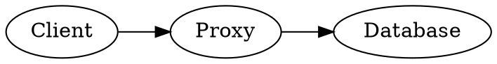
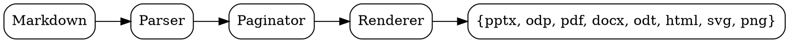

# Quick start

## One command, eight formats

You wrote Markdown. md2any turns it into a polished deliverable — slides, documents, or PDF — without spawning Office, calling a JRE, or running a Python pipeline.

```bash
md2any talk.md                 # → talk.pptx (PowerPoint)
md2any talk.md -o talk.odp     # → talk.odp  (LibreOffice Impress)
md2any talk.md -o talk.pdf     # → talk.pdf  (PDF 1.7)
md2any talk.md -o talk.docx    # → talk.docx (Microsoft Word)
md2any talk.md -o talk.odt     # → talk.odt  (LibreOffice Writer)
md2any talk.md -o talk.html    # → talk.html (browser deck)
md2any talk.md --format svg -o talk-svg/   # → one SVG per slide
md2any talk.md --format png -o talk-png/   # → one PNG per slide
```

One Rust binary. No runtime dependencies. Cross-platform.

## What md2any can do now

md2any is built for the boring part of technical publishing: one source file, many artifacts, repeatable in CI.

| Area | Capabilities |
|------|--------------|
| Outputs | PPTX, ODP, PDF, DOCX, ODT, standalone HTML, SVG slide images, PNG slide images |
| Slides | Section dividers, four deck layouts, light/dark themes, custom page sizes, transitions, TOC slides, presenter notes |
| Documents | Report-style DOCX/ODT with title page, contents, headers/footers, styled code/tables, image captions, notes appendices |
| Pagination | Smart continuation splitting for paragraphs, lists, code, columns, and tables; density control with `--break-fill` |
| Tables | Auto table fitting, column-group splitting, key-column repeat, portrait transposition |
| Code | Dark-by-default code blocks, independent code palette, 40+ syntax tags, filename captions, file/range includes, automatic line numbers, landscape two-up code flow |
| Math | Native Unicode math, generated display SVG math, and full-page markup math with selectable PDF text |
| Images | Local (PNG/JPEG/SVG/WebP), remote, SVG rasterisation, remote cache/retry, full-page image slides, background images, width hints, `--localize` for self-contained decks, multi-source image search |
| Fonts | Bundled DejaVu PDF fonts, custom PDF fonts, fallback fonts, CJK opt-in, glyph audit, Arabic/Hebrew/Indic/Thai shaping |
| Editor | `--serve --edit`: in-browser live-DOM editor, caret↔slide sync, style panel, AI dock with one-click edits and image search |
| Workflow | `--watch`, live `--serve` preview in PDF/HTML/SVG/PNG, `--generate` AI drafting, linting, outline, IR JSON, render-plan JSON |

The design goal is not to be Pandoc, Quarto, TeX, or a presentation GUI. It is a deterministic artifact generator that keeps the common deck/document job small enough to ship as one binary.

## Self-documenting

This deck is the embedded user manual. Regenerate it in any format, any layout, any theme:

```bash
md2any --help-pptx                       # this deck → md2any-help.pptx
md2any --help-pdf --theme dark           # dark PDF
md2any --help-odp --layout studio        # studio layout, ODP
md2any --help-docx                       # → Word document
md2any --help-odt                        # → LibreOffice Writer document
md2any --help-html                       # → standalone browser deck
md2any --help-svg -o manual-svg/          # → one SVG per manual slide
md2any --help-png -o manual-png/          # → one PNG per manual slide
md2any --help-md > HELP.md               # raw markdown source
```

Every `--help-*` flag respects every other flag.

# Anatomy of a deck

## Pagination rules

md2any turns Markdown headings into slides. Memorize three rules:

- The first `# H1` (or the front-matter `title`) becomes the **title slide**
- Every subsequent `# H1` becomes a **section divider**
- Every `## H2` starts a **content slide**
- A horizontal rule `---` forces a slide break without changing the title
- `### H3` and deeper render as inline headings on the current slide

Long content auto-paginates into `(cont.)` slides. Lists with more than 12 items wrap into two columns automatically (except in portrait mode). The default `--break-mode smart` splits overlong paragraphs, lists, code, tables, and columns at readable boundaries; use `--break-mode simple` for conservative block-level splitting or `--break-mode off` to disable automatic continuation splitting. `--break-fill PCT` controls density before a break: lower than 100 creates more, airier slides; higher values pack tighter. Pagination is skipped in DOCX/ODT — those formats flow continuously and let the consumer paginate.

## Front matter

Put YAML between `---` fences at the top of the file.

```yaml
---
title: My Talk
subtitle: A subtitle for the title slide
author: Your Name
date: auto              # or 2026-05-23, or "today"
theme: light            # light | dark
aspect: 16:9            # see "Aspect ratios" below for all presets,
                        # or `WxH[unit]` e.g. 1920x1080, 300x200mm, 13.3x7.5in
layout: clean           # clean | studio | frame | bold
math: unicode           # unicode | source | svg
math_scale: 1.0         # generated SVG display math scale
math_block_align: center # left | center | right
math_max_height: 180    # generated display math height cap
math_macros:
  '\RR': '\mathbb{R}'   # exact math substitutions before rendering
doc_style: report       # plain | report | handout | speaker-notes
break_mode: smart       # smart | simple | off
break_fill: 100         # 50-120; lower breaks earlier, higher packs tighter
table_fit: auto         # auto | split | transpose | off
code_theme: dark        # dark | light | match; default is dark, independent of theme
code_columns: single    # single | auto | two-up; landscape code flow
font: Inter             # any installed font (PPTX/ODP/DOCX/ODT)
logo: brand.png         # rendered in slide footer
toc: true               # inject a Contents slide after the title
transition: fade        # none | fade | push | wipe | cover | split
transition_duration: 0.6  # seconds
direction: ltr          # ltr | rtl
---
```

Every key is optional. CLI flags override front matter; front matter overrides defaults.

# Markdown reference

## Inline formatting

The usual:

- `**bold**` → **bold**
- `*italic*` → *italic*
- `` `inline code` `` → `inline code`
- `~~strikethrough~~` → ~~strikethrough~~
- `[link text](url)` → [link text](https://example.com) — **clickable in every format**

All eight output formats render these natively — no raw-HTML workaround, no extension.

## Lists

Nested up to nine levels. Numbered and bulleted lists are independent.

- First level item
- Second top-level item
  - Nested item
  - Another nested item
    - Triple-nested
- Back to level 1

```markdown
1. Step one
2. Step two
   1. Sub-step
   2. Another sub-step
3. Step three
```

If a list has more than 12 items, md2any auto-flows it into two columns (slide output only).

## Code blocks

Fenced code blocks pick up syntax highlighting from the language tag. Code blocks default to a dark editor-style palette even when the deck uses `theme: light`; use `--code-theme light` for light code blocks or `--code-theme match` to make code follow the main theme.

40+ language tags built in:

- Mainstream: `rust`, `python`, `js` / `ts` / `jsx` / `tsx`, `go`, `c` / `cpp`, `java`, `kotlin`, `scala`, `csharp`, `ruby`, `bash`, `powershell`, `sql`
- Functional / retro: `haskell`, `bcpl`, `bf`
- Data / config: `json`, `yaml`, `toml`, `ini`, `env`, `properties`, `terraform` / `hcl`, `dockerfile`
- Web / API: `html`, `xml`, `css`, `vue`, `svelte`, `astro`, `graphql`, `http`, `diff`, `markdown`
- Mainframe / IBM i: `cobol`, `jcl`, `rexx`, `pl1` / `pli` / `plx`, `hlasm`, `db2`, `rpg` / `rpg2` / `rpg3`, `rpgle` / `rpgfree`, `cl` / `clle`

## Code blocks (continued)

A bare fence picks the language only:

````
```rust
fn main() { println!("hi"); }
```
````

Add a filename after the language and md2any renders a header bar:

````
```rust src/main.rs
fn main() { println!("hi"); }
```
````

Code blocks longer than five lines get line numbers automatically. When a long
code block is split across continuation slides, numbering continues from the
original source line instead of restarting at 1.

Code theme is independent of the main deck theme:

```bash
md2any talk.md --code-theme dark   # default
md2any talk.md --code-theme light
md2any talk.md --code-theme match  # old behavior: follow --theme
```

Landscape code can flow left/right on one slide:

```bash
md2any talk.md --code-columns single  # default
md2any talk.md --code-columns auto    # only when a block is long and readable
md2any talk.md --code-columns two-up  # force eligible landscape blocks
```

Per-fence overrides use `columns=1`, `columns=auto`, or `columns=2`:

````
```rust columns=2 title="one method"
fn parse(input: &str) {
    // left column continues into right column with line numbers preserved
}
```
````

## Code — two-up / n-up

For code, n-up currently means one-up or two-up. Use `columns=2` when a long, narrow listing reads better as left/right columns on a landscape slide. `columns=auto` lets md2any choose two-up only when the block is long enough and not too wide.

```rust columns=2 title="src/window.rs" start=42
pub fn visible_window(items: &[Item], selected: usize, height: usize) -> Range<usize> {
    let height = height.max(1);
    let len = items.len();
    if len <= height {
        return 0..len;
    }
    let half = height / 2;
    let mut start = selected.saturating_sub(half);
    if start + height > len {
        start = len - height;
    }
    let end = (start + height).min(len);
    start..end
}

pub fn clamp_selection(selected: usize, len: usize) -> usize {
    selected.min(len.saturating_sub(1))
}
```

Two-up is landscape-only. In portrait aspects, md2any keeps code one-up so the columns do not become unreadable. Three-up and wider code layouts are intentionally not exposed; code usually turns into eye chart territory before it becomes useful.

## Tables

GitHub-flavored Markdown tables. Banded rows, accent-colored header.

| Column | Type | Notes |
|--------|------|-------|
| name   | text | first column |
| size   | int  | second column |
| active | bool | third column |

Alignment hints (`:--`, `:-:`, `--:`) parse but render as left for now.

## Side-by-side columns

Put `:::` on a line by itself to split a slide into two columns:

```markdown
## Pros and cons

Left side content goes here. Bullets, paragraphs, code, all work.

:::

Right side content. Independently paginated.
```

In slide output both columns scale to fit. In document output (DOCX/ODT) columns flatten into back-to-back blocks.

## Blockquotes

Render with a vertical accent bar and italic body text.

> The best presentation tool is the one that gets out of your way.
>
> Plain text in, polished slides out. That's the whole product.

## Math

md2any has native math support. It is deliberately not TeX: no TeX runtime, no MathJax, no shelling out, no bundled equation renderer. The implementation is a small deterministic parser/layout engine aimed at talks, technical notes, and CI-friendly output.

There are three normal math modes:

- `--math unicode` (default) translates inline `$...$` and display `$$...$$` spans into readable Unicode at parse time.
- `--math source` leaves `$...$` and `$$...$$` untouched for a downstream tool, reviewer, or source-preserving workflow.
- `--math svg` lays out display `$$...$$` blocks with md2any's built-in box model and embeds generated SVG image data. Inline `$...$` remains source text in this mode.

`--math svg` understands multi-line display blocks, stacked fractions, square-root bars, positioned scripts, scalable delimiters, simple matrices, arrays, `cases`, and aligned equations. The generated SVG passes through the normal image pipeline for PPTX, ODP, PDF, HTML, SVG, PNG, DOCX, and ODT.

Generated display math can be tuned without adding a TeX runtime:

```bash
md2any talk.md --math svg --math-scale 0.9 --math-block-align left --math-max-height 160
```

The same controls are available in front matter as `math_scale`, `math_block_align`, and `math_max_height`.

For repeated notation, define exact substitutions in front matter. Use single quotes around TeX-style keys so YAML does not treat backslashes as escapes:

```yaml
math_macros:
  '\RR': '\mathbb{R}'
  '\NN': '\mathbb{N}'
```

```markdown
Einstein wrote $E = mc^2$.

$$\sum_{i=1}^{n} i = \frac{n(n+1)}{2}$$
```

The next slides walk through every construct md2any understands, with source on the left and what it renders to on the right. `--check` reports unsupported rich constructs in the default Unicode mode before they silently degrade.

## Math — full-page markup

For dense formula pages, use `text-full` with a fenced `math` block. This is the path for "make this A4 page a formula, not a normal slide":

````markdown
---
aspect: a4
break_mode: off
---

<!-- layout: text-full -->

```math
\mathcal{L}_{SM} = -\frac{1}{2}\partial_\nu g^a_\mu\partial^\nu g^{a\mu}
-g_s f^{abc}\partial_\mu g^a_\nu g^{b\mu}g^{c\nu}
```
````

PDF renders this as selectable positioned text plus vector strokes for bars, radicals, and delimiters. SVG/PNG render the same positioned layout. It is useful for posters, paper-sized technical pages, and stress-test equations such as the Standard Model Lagrangian.

This is still md2any-native math, not TeX typography. Expect readable deck-quality layout, not publication-grade mathematical typesetting.

## Math — Greek letters

| Source       | Renders as | Source       | Renders as |
|--------------|------------|--------------|------------|
| `$\alpha$`   | $\alpha$   | `$\nu$`      | $\nu$      |
| `$\beta$`    | $\beta$    | `$\xi$`      | $\xi$      |
| `$\gamma$`   | $\gamma$   | `$\pi$`      | $\pi$      |
| `$\delta$`   | $\delta$   | `$\rho$`     | $\rho$     |
| `$\epsilon$` | $\epsilon$ | `$\sigma$`   | $\sigma$   |
| `$\zeta$`    | $\zeta$    | `$\tau$`     | $\tau$     |
| `$\eta$`     | $\eta$     | `$\upsilon$` | $\upsilon$ |
| `$\theta$`   | $\theta$   | `$\phi$`     | $\phi$     |
| `$\iota$`    | $\iota$    | `$\chi$`     | $\chi$     |
| `$\kappa$`   | $\kappa$   | `$\psi$`     | $\psi$     |
| `$\lambda$`  | $\lambda$  | `$\omega$`   | $\omega$   |
| `$\mu$`      | $\mu$      | `$\aleph$`   | $\aleph$   |

Uppercase forms work the same way: `$\Gamma$` → $\Gamma$, `$\Delta$` → $\Delta$, `$\Theta$` → $\Theta$, `$\Lambda$` → $\Lambda$, `$\Xi$` → $\Xi$, `$\Pi$` → $\Pi$, `$\Sigma$` → $\Sigma$, `$\Phi$` → $\Phi$, `$\Psi$` → $\Psi$, `$\Omega$` → $\Omega$.

## Math — big operators

| Source         | Renders as     |
|----------------|----------------|
| `$\sum$`       | $\sum$         |
| `$\prod$`      | $\prod$        |
| `$\int$`       | $\int$         |
| `$\oint$`      | $\oint$        |
| `$\bigcup$`    | $\bigcup$      |
| `$\bigcap$`    | $\bigcap$      |
| `$\sum_{i=1}^{n} i$` | $\sum_{i=1}^{n} i$ |
| `$\int_a^b f(x) dx$` | $\int_a^b f(x) dx$ |
| `$\prod_{k=1}^{n} k$` | $\prod_{k=1}^{n} k$ |

Subscripts and superscripts after a big operator render as small adjacent glyphs. Stacked above/below limits are outside md2any's small math layout model.

## Math — relations

| Source       | Renders as | Source        | Renders as  |
|--------------|------------|---------------|-------------|
| `$\leq$`     | $\leq$     | `$\equiv$`    | $\equiv$    |
| `$\geq$`     | $\geq$     | `$\sim$`      | $\sim$      |
| `$\neq$`     | $\neq$     | `$\simeq$`    | $\simeq$    |
| `$\approx$`  | $\approx$  | `$\propto$`   | $\propto$   |

```markdown
$a \leq b \neq c \approx d \propto e$
```

Renders as: $a \leq b \neq c \approx d \propto e$

## Math — arrows

| Source              | Renders as          |
|---------------------|---------------------|
| `$\to$`             | $\to$               |
| `$\rightarrow$`     | $\rightarrow$       |
| `$\leftarrow$`      | $\leftarrow$        |
| `$\Rightarrow$`     | $\Rightarrow$       |
| `$\Leftarrow$`      | $\Leftarrow$        |
| `$\leftrightarrow$` | $\leftrightarrow$   |
| `$\Leftrightarrow$` | $\Leftrightarrow$   |
| `$\mapsto$`         | $\mapsto$           |

Use the capitalised forms (`\Rightarrow`, `\Leftrightarrow`) for logical implication; the lowercase forms are for set membership / function notation.

## Math — set and logic

| Source        | Renders as | Source         | Renders as  |
|---------------|------------|----------------|-------------|
| `$\in$`       | $\in$      | `$\forall$`    | $\forall$   |
| `$\notin$`    | $\notin$   | `$\exists$`    | $\exists$   |
| `$\subset$`   | $\subset$  | `$\nexists$`   | $\nexists$  |
| `$\subseteq$` | $\subseteq$| `$\emptyset$`  | $\emptyset$ |
| `$\supset$`   | $\supset$  | `$\land$`      | $\land$     |
| `$\supseteq$` | $\supseteq$| `$\lor$`       | $\lor$      |
| `$\cup$`      | $\cup$     | `$\lnot$`      | $\lnot$     |
| `$\cap$`      | $\cap$     | `$\setminus$`  | $\setminus$ |

```markdown
$\forall x \in \mathbb{N}, \exists y : y > x$
```

Renders as: $\forall x \in \mathbb{N}, \exists y : y > x$

## Math — super and subscripts

| Source            | Renders as        |
|-------------------|-------------------|
| `$x^2$`           | $x^2$             |
| `$a_i$`           | $a_i$             |
| `$x^{n+1}$`       | $x^{n+1}$         |
| `$a_{ij}$`        | $a_{ij}$          |
| `$a_{ij}^{k+1}$`  | $a_{ij}^{k+1}$    |
| `$e^{i\pi}$`      | $e^{i\pi}$        |
| `$\sigma_x$`      | $\sigma_x$        |

A single character following `^` or `_` is the superscript / subscript; for multi-character groups wrap them in `{…}`.

## Math — fractions, roots, binomials

| Source                | Renders as            |
|-----------------------|-----------------------|
| `$\frac{a}{b}$`       | $\frac{a}{b}$         |
| `$\frac{1}{1-r}$`     | $\frac{1}{1-r}$       |
| `$\sqrt{x}$`          | $\sqrt{x}$            |
| `$\sqrt{a^2 + b^2}$`  | $\sqrt{a^2 + b^2}$    |
| `$\binom{n}{k}$`      | $\binom{n}{k}$        |

```markdown
$\frac{-b \pm \sqrt{b^2 - 4ac}}{2a}$
```

Renders as: $\frac{-b \pm \sqrt{b^2 - 4ac}}{2a}$

In `--math unicode` mode, fractions and roots render inline as readable Unicode/ASCII. In `--math svg` display blocks, the built-in layout engine draws a real fraction bar and radical overbar.

## Math — accents, text, and alphabets

| Source                       | Renders as                    |
|------------------------------|-------------------------------|
| `$\vec{x}$`                  | $\vec{x}$                     |
| `$\bar{x}$`                  | $\bar{x}$                     |
| `$\hat{\theta}$`             | $\hat{\theta}$                |
| `$\tilde{A}$`                | $\tilde{A}$                   |
| `$\dot{x}$`                  | $\dot{x}$                     |
| `$\ddot{x}$`                 | $\ddot{x}$                    |
| `$\overline{AB}$`            | $\overline{AB}$               |
| `$\mathrm{rank}(A)$`         | $\mathrm{rank}(A)$            |
| `$\text{score} = 1$`         | $\text{score} = 1$            |
| `$\operatorname*{argmax}_x$` | $\operatorname*{argmax}_x$    |
| `$\mathbb{R}^n$`             | $\mathbb{R}^n$                |
| `$\mathcal{F}$`              | $\mathcal{F}$                 |

Accents use Unicode combining marks, so they are readable and selectable but not TeX-positioned. `\mathbb{...}` maps common uppercase sets such as `\mathbb{N}`, `\mathbb{Z}`, `\mathbb{Q}`, `\mathbb{R}`, and `\mathbb{C}` to their blackboard Unicode forms. `\mathcal{...}` maps uppercase letters where Unicode has script codepoints.

## Math — operator names

LaTeX `\log` / `\sin` / etc. don't exist as Unicode characters; they're typeset as roman text inside math. md2any preserves them as plain ASCII with a trailing space so multiplication doesn't merge them with their argument.

| Source             | Renders as           |
|--------------------|----------------------|
| `$\log n$`         | $\log n$             |
| `$\ln x$`          | $\ln x$              |
| `$\sin \theta$`    | $\sin \theta$        |
| `$\cos \theta$`    | $\cos \theta$        |
| `$\tan \theta$`    | $\tan \theta$        |
| `$\max(a, b)$`     | $\max(a, b)$         |
| `$\min(a, b)$`     | $\min(a, b)$         |
| `$\lim_{x \to 0}$` | $\lim_{x \to 0}$     |
| `$\exp(x)$`        | $\exp(x)$            |
| `$\det A$`         | $\det A$             |
| `$\gcd(a, b)$`     | $\gcd(a, b)$         |

Also recognised: `\sec` `\csc` `\cot` `\sinh` `\cosh` `\tanh` `\arcsin` `\arccos` `\arctan` `\lg` `\sup` `\inf` `\argmax` `\argmin` `\rank` `\trace` `\tr` `\span`.

## Math — delimiters and spacing

In `--math unicode`, delimiter sizing macros collapse to readable plain delimiters. In `--math svg`, `\left...\right` pairs around fractions, matrices, arrays, and cases use drawn scalable delimiters so tall content is bracketed cleanly. `\big` / `\Big` / `\bigg` / `\Bigg` still act as lightweight delimiter hints rather than full TeX sizing commands.

| Source                          | Renders as                      |
|---------------------------------|---------------------------------|
| `$\left( x + y \right)$`        | $\left( x + y \right)$          |
| `$\big[ a, b \big]$`            | $\big[ a, b \big]$              |
| `$\Big\| \vec{v} \Big\|$`       | $\Big| \vec{v} \Big|$           |

Spacing macros map to ASCII space approximations: `\quad` → two spaces, `\qquad` → four, `\,` / `\:` / `\;` → thin space, `\!` → no-op.

## Math — dots and ellipses

| Source         | Renders as |
|----------------|------------|
| `$\ldots$`     | $\ldots$   |
| `$\cdots$`     | $\cdots$   |
| `$\vdots$`     | $\vdots$   |
| `$\ddots$`     | $\ddots$   |

```markdown
$x_1, x_2, \ldots, x_n$
$x_1 + x_2 + \cdots + x_n$
```

Render as: $x_1, x_2, \ldots, x_n$ and $x_1 + x_2 + \cdots + x_n$.

## Math — what md2any is *not*

The default Unicode math support is intentionally shallow. If you need readable multi-line display math, stacked fractions, radical bars, scalable delimiters, simple matrices/arrays, `cases`, or aligned equations, use `--math svg`. If you need a full-page formula with selectable PDF text, use `<!-- layout: text-full -->` with a fenced `math` block.

- **No TeX engine** — md2any does not run TeX, embed TeX, require TeX, or promise TeX-compatible spacing.
- **No publication-grade equation typography** — the built-in box model is good enough for talk decks and technical pages, not a replacement for a dedicated mathematical typesetting system.
- **No equation numbering** — there is no `\label` / `\ref` mechanism.
- **Copy/paste is best-effort for positioned math** — PDF text remains selectable via `/ToUnicode`, but a reader may paste positioned superscripts/fractions in geometric order rather than source order.

Everything *not* on that list works, and what works is enough for typical talk-deck math: equations, summations, integrals, set notation, predicate logic, accents, text labels, blackboard sets, simple rich display blocks, and dense A4 formula pages.

## Math — copy-paste from PDF

PDF text is copy-pasteable. md2any writes a `/ToUnicode` CMap with every embedded font, so selecting a formula in your PDF reader gives you back real Unicode characters — not glyph indices, not Latin substitutes.

Try it: open the manual PDF, select `∑ᵢ₌₁ⁿ xᵢ²` from any math slide, paste somewhere. You'll get the actual Unicode characters back.

This works for every glyph in every face: Greek, math operators, sub/superscripts, the CJK fallback if you passed `--cjk`, the line-drawing characters in the Unicode coverage slide.

Full-page `math` fences use many positioned text runs so superscripts, subscripts, and fraction parts sit where they should visually. The glyphs remain selectable, but PDF readers may paste them in geometric order rather than the original source order.

## Diagrams

Code fences with `dot`, `graphviz`, `mermaid`, or `plantuml` shell out to the matching CLI tool if it's on `$PATH` and embed the rendered PNG. If the tool isn't installed, the source stays as a regular code block.

````

````

## Footnotes

Markdown footnotes (`[^id]`) render as superscript ¹²³ in the body, with definitions collected at the bottom of the slide where they were referenced.

```markdown
Rust was first released in 2015[^rust].

[^rust]: Originally a personal project by Graydon Hoare at Mozilla.
```

## Horizontal rules

A line containing just `---` forces a slide break while keeping the current section title. Use it for long sections that need to split across slides without introducing a new H2.

## Images

Standard markdown image syntax works in every output format:

```markdown


```

Three sources, one syntax:

- **Local PNG / JPEG / WebP** — resolved relative to the markdown file, embedded as-is. WebP is decoded natively (no external tools).
- **Remote URL** (`http://` or `https://`) — fetched at build time with a 10 s timeout, capped at 20 MB per image, and cached after a successful download. The default cache location follows the host OS convention: `%LOCALAPPDATA%` on Windows, `~/Library/Caches` on macOS, and `$XDG_CACHE_HOME` / `~/.cache` on Linux and other Unix systems.
- **SVG** — rasterised to PNG via the bundled resvg engine at 192 DPI (2× retina), then embedded the same way as a regular raster image. Text in SVGs uses md2any's bundled DejaVu Sans family so renders look identical regardless of what's installed on the build machine.

Aspect ratio is preserved; the slide layout decides how much room each image gets.

### Sizing — `{width=N%}`

Append a Pandoc-style attribute to set the image to a fraction of the content column (slide formats only — DOCX/ODT defer to the consumer app):

```markdown
{width=50%}
{width=20%}
```

Valid range is 1–100. Unrecognised attributes are ignored silently. Without the attribute, the image fills the content column at its native aspect ratio.

### Image layout directives

Use layout directives when an image should drive the slide geometry:

```markdown
## Architecture

<!-- layout: image-left -->


Walks the request through the API gateway, then the service mesh,
then into the database tier. Each hop is observable via OpenTelemetry.
```

`<!-- layout: image-left -->` puts the image on the left and everything else on the right. `<!-- layout: image-right -->` does the opposite. The directive triggers only when the slide has exactly one image; otherwise it's ignored.

For a page that is itself an image, use `<!-- layout: image-full -->` on a slide with exactly one image. Slide renderers skip titles, rails, sidebars, and normal content image caps, then fit the image to the full page without distorting it. This is useful for source-image pages, posters, scanned handouts, or A4/Letter fixtures.

For a page that should remain selectable text, use `<!-- layout: text-full -->` on a slide with exactly one fenced code block. Slide renderers skip titles, rails, and sidebars, then fit the block to the full page.

- Fenced blocks tagged `text`, `rust`, `python`, and so on render as fitted text/code.
- A fenced block tagged `math` uses md2any's math layout engine: PDF gets selectable positioned text plus vector fraction/radical/delimiter strokes, and SVG/PNG get the same visual layout.

This is useful for dense code listings, source excerpts, formula pages, posters, and A4/Letter technical fixtures where keeping text selectable matters.

Remote-image cache controls:

```bash
md2any talk.md -o talk.pdf
md2any talk.md --remote-image-cache ./.md2any-cache -o talk.pdf
md2any talk.md --no-remote-image-cache -o talk.pdf
md2any talk.md --remote-image-user-agent "my-build/1.0" -o talk.pdf
```

Remote fetches retry transient failures (HTTP 408 / 429 / 500 / 502 / 503 / 504, network errors) up to three times with capped exponential backoff (max 30 s per wait), honouring `Retry-After` in both delta-seconds and HTTP-date forms. If your binary was compiled without the `remote-images` feature, `http://` and `https://` image references fail with a clear error; local images still work.

**On failure: placeholder instead of abort.** If an image can't be loaded — network failure, 404, garbage body, file missing, payload over the 20 MB cap, broken SVG — md2any prints a one-line stderr warning naming the source and the reason, then substitutes a red "Image failed to load" placeholder that includes the URL and error text. The render completes; you ship a deck where every missing-image slot is visibly flagged rather than discovering the failure when a viewer opens the file. CI pipelines can grep stderr for `warning: image failed` to surface the issue without failing the build.

**Cache retention.** Remote images are fetched once and reused on every subsequent render — there's no expiry and no conditional `If-Modified-Since` / `ETag` round-trip. If a remote image gets updated upstream, you'll keep seeing the old version until you delete the cache file. The default cache directory follows the platform convention; `md2any doctor` prints the resolved path. Clearing is just `rm -rf <cache-dir>/remote-images/`. The cap is 20 MB per image; oversized payloads trip the placeholder substitution above instead of silently truncating.

### Self-contained decks — `--localize`

Caching speeds up rebuilds, but the markdown still points at remote URLs — share the file and the images break. `--localize` downloads every remote `http(s)` image into an `assets/` folder next to the deck, rewrites the links to the local paths, and saves the file in place:

```bash
md2any talk.md --localize
```

Originals are kept byte-for-byte for supported formats (a 2 MB JPEG stays a 2 MB JPEG; WebP stays WebP) rather than being re-encoded, and the extension is set from the file's magic bytes. The result is an offline, portable deck you can commit or hand off. The in-browser editor calls the same routine automatically whenever it inserts an image, and exposes it as `POST /localize`.

## Per-slide background

An HTML comment with `bg:` sets a full-bleed background image for the current slide.

```markdown
# Hero slide

<!-- bg: photos/hero.jpg -->

A statement.
```

Images load relative to the deck file. Background propagates through `(cont.)` continuation slides.

# Layouts

## Four ways to dress a deck

Same Markdown, different visual treatment:

- `clean` — minimal title underline + full-bleed content (default)
- `studio` — vertical accent rail, italic titles, big background numerals on sections
- `frame` — left sidebar carries deck title + slide number; content on the right
- `bold` — full-width accent block behind every title

Pick with `--layout NAME` or set `layout:` in front matter.

## When to use which

**clean** for talks where content should dominate. Minimal chrome.

**studio** for editorial / design-review decks. Italics, rails, big numerals. Looks serious without being heavy.

:::

**frame** for long training and onboarding decks where a persistent reference panel helps the audience.

**bold** for keynote-style events. Every section transition feels intentional. Maximum accent color.

## Per-slide controls

Beyond the layout *kind*, a handful of HTML-comment directives tune one slide at a time. Drop them anywhere on the slide; they apply to the slide they sit in and are ignored by formats that can't honour them (DOCX/ODT).

| Directive | Effect |
|---|---|
| `<!-- valign: center \| bottom \| top -->` | Vertical alignment of the content (and of each column in a two-column layout). |
| `<!-- align: left \| center \| right -->` | Horizontal alignment of the slide's text blocks. |
| `<!-- text-scale: N -->` | Multiply this slide's body/heading/list sizes by `N` (0.5–2.5). Keywords also work: `small`, `large`, `larger`, `huge`. Aliases: `text-size:`, `font-scale:`. Big-text slides re-paginate so they don't overflow. |
| `<!-- cards: N -->` | Group the slide's `### Title` blocks into an N-column card grid (1–6; bare `<!-- cards -->` auto-fits). |
| `<!-- bg: #hex \| accent \| section -->` | Per-slide background **colour** (a hex value or a palette keyword). A `bg:` that names an image path sets a background **image** instead (see *Per-slide background*). |
| `width=NN%` on a layout hint | Sizes the image column in `image-left` / `image-right`, e.g. `<!-- layout: image-left width=60% -->`. The text column takes the rest. |

```markdown
## Big statement

<!-- valign: center -->
<!-- align: center -->
<!-- text-scale: large -->

One line, centred, large.
```

These are exactly the controls the editor's 🎨 style panel and 🤖 AI dock write for you, so anything they produce is plain markdown you can hand-edit and commit. Hex colours in front matter must be quoted (`accent: "#818cf8"`); these inline `bg:` directives accept bare hex.

# Themes

## Light vs dark

Two carefully-tuned palettes. Every layout supports both.

**Light theme**

White background, slate text, sky-blue accent. Reads well in bright rooms, prints cleanly.

```
--theme light    (default)
```

:::

**Dark theme**

Slate-900 background, frost-bright accent. Reads well on stage, easier on the eyes during long talks.

```
--theme dark
```

## Custom palettes

For brand-specific decks, override colors, fonts, and sizes with a YAML overlay. Pass it with `--theme-file PATH`. The overlay merges on top of whatever `--theme` selects (default `light`); only the keys you set are changed.

```bash
md2any talk.md --theme-file brand.yaml -o talk.pdf
```

Hex colours accept `#RRGGBB` or bare `RRGGBB`. Sizes are in hundredths of a typographic point (so `1800` = 18 pt). Font names must exist on the consumer's machine for PPTX/ODP/DOCX/ODT. PDF uses bundled DejaVu by default, but can load explicit TTF/OTF paths from CLI flags or from the theme file.

## --theme-file — colour keys

| Key            | Role                           | Light default | Dark default |
|----------------|--------------------------------|---------------|--------------|
| `bg`           | Slide background               | `#FFFFFF`     | `#0B1220`    |
| `title_color`  | Slide title text               | `#0F172A`     | `#F8FAFC`    |
| `body_color`   | Body / paragraph text          | `#334155`     | `#CBD5E1`    |
| `muted_color`  | Footer, captions, slide number | `#94A3B8`     | `#64748B`    |
| `accent`       | Underline bar, links, ✓ markers| `#0EA5E9`     | `#38BDF8`    |
| `accent_soft`  | Tag chips, code-fence label bg | `#E0F2FE`     | `#0C4A6E`    |
| `divider`      | Hairline rule under titles     | `#E2E8F0`     | `#1E293B`    |
| `code_bg`      | Code block fill                | `#F1F5F9`     | `#111A2E`    |
| `code_text`    | Code text (when not tokenised) | `#1E293B`     | `#E2E8F0`    |
| `code_accent`  | Inline `code` text             | `#0369A1`     | `#7DD3FC`    |
| `section_bg`   | Section-divider slide fill     | `#0F172A`     | `#0EA5E9`    |
| `section_text` | Section-divider slide text     | `#F8FAFC`     | `#FFFFFF`    |
| `link`         | Hyperlink text                 | `#0EA5E9`     | `#7DD3FC`    |
| `on_accent`    | Text drawn over `accent`       | `#FFFFFF`     | `#0B1220`    |

## --theme-file — fonts and sizes

| Key           | Role                                | Default (16:9)    |
|---------------|-------------------------------------|-------------------|
| `title_font`  | Title bar / heading typeface        | `Calibri Light`   |
| `body_font`   | Paragraph + list typeface           | `Calibri`         |
| `mono_font`   | Code / inline-code typeface         | `Consolas`        |
| `pdf_font`    | PDF sans/body TTF/OTF path          | bundled DejaVu    |
| `pdf_mono_font` | PDF mono/code TTF/OTF path        | bundled DejaVu Mono |
| `font_fallback` | PDF fallback path or list         | none              |
| `title_size`  | Title size, hundredths of pt        | `2800` (28 pt)    |
| `body_size`   | Body size, hundredths of pt         | `1800` (18 pt)    |
| `code_size`   | Code-block size, hundredths of pt   | `1500` (15 pt)    |
| `hero_size`   | Title-slide hero text, hundredths   | `5400` (54 pt)    |

Portrait aspects (9:16, A4, A5, Letter) ship slightly smaller defaults: `2400 / 1700 / 1400 / 4200`.

## --theme-file — syntax highlighting

Nested under a `syntax:` key. Each value is a hex colour applied to that token class across every supported language.

By default, fenced code blocks use the dark code palette regardless of the main `--theme`. Set `code_theme: light` or pass `--code-theme light` to force light code blocks; set `match` to make code follow the main theme. Explicit `code_bg`, `code_text`, `code_accent`, or `syntax:` values in a theme file still override the selected code palette.

| Key         | Role                              | Light default | Dark default |
|-------------|-----------------------------------|---------------|--------------|
| `keyword`   | `fn`, `class`, `SELECT`, etc.     | `#9333EA`     | `#C792EA`    |
| `string`    | String + char literals            | `#16A34A`     | `#C3E88D`    |
| `number`    | Numeric + boolean literals        | `#C2410C`     | `#FFCB6B`    |
| `comment`   | Line + block comments             | `#94A3B8`     | `#6B7B8E`    |
| `function`  | Function and method names         | `#2563EB`     | `#82AAFF`    |
| `type`      | Type names, capitalised idents    | `#0891B2`     | `#FFC777`    |
| `attribute` | Decorators, `#[derive]`, JSX attr | `#DC2626`     | `#F78C6C`    |

## --theme-file — full example

```yaml
# brand.yaml — a complete overlay touching every category
bg:           "#FFFCF7"
title_color:  "#0A0A23"
body_color:   "#1F2937"
muted_color:  "#9CA3AF"
accent:       "#FF6B35"
accent_soft:  "#FFE4D6"
divider:      "#E5E0D5"
code_bg:      "#F5F0E6"
code_text:    "#1F2937"
code_accent:  "#B8410B"
section_bg:   "#0A0A23"
section_text: "#FFFCF7"
link:         "#B8410B"
on_accent:    "#FFFCF7"

title_font: "Inter"
body_font:  "Inter"
mono_font:  "JetBrains Mono"
pdf_font: "fonts/Inter-Regular.ttf"
pdf_mono_font: "fonts/JetBrainsMono-Regular.ttf"
font_fallback:
  - "fonts/NotoSansMath-Regular.ttf"

title_size: 3000
body_size:  1900
code_size:  1500
hero_size:  5800

syntax:
  keyword:   "#D946EF"
  string:    "#15803D"
  number:    "#B8410B"
  comment:   "#9CA3AF"
  function:  "#1D4ED8"
  type:      "#0E7490"
  attribute: "#BE123C"
```

Set only the keys you want to change — anything omitted inherits from the underlying `--theme`. Theme fonts are names for PPTX/ODP/DOCX/ODT; PDF font keys are file paths and are embedded/subset in the output PDF. Relative PDF font paths in a theme file resolve next to that theme file.

# Aspect ratios

## Built-in presets

| Flag value         | Dimensions (mm)    | Dimensions (in)   | Use for                                  |
|--------------------|--------------------|-------------------|------------------------------------------|
| `16:9`             | 338.7 × 190.5 mm   | 13.33″ × 7.5″     | Modern projectors and screens (default)  |
| `4:3`              | 254 × 190.5 mm     | 10″ × 7.5″        | Legacy projectors                        |
| `9:16`             | 190.5 × 338.7 mm   | 7.5″ × 13.33″     | Vertical / phone-shaped                  |
| `a4`               | 210 × 297 mm       | 8.27″ × 11.69″    | A4 portrait (ISO 216)                    |
| `a4-landscape`     | 297 × 210 mm       | 11.69″ × 8.27″    | A4 landscape                             |
| `a3`               | 297 × 420 mm       | 11.69″ × 16.54″   | A3 portrait                              |
| `a5`               | 148 × 210 mm       | 5.83″ × 8.27″     | A5 portrait                              |
| `letter`           | 215.9 × 279.4 mm   | 8.5″ × 11″        | US Letter portrait (ANSI A)              |
| `letter-landscape` | 279.4 × 215.9 mm   | 11″ × 8.5″        | US Letter landscape                      |
| `legal`            | 215.9 × 355.6 mm   | 8.5″ × 14″        | US Legal                                 |
| `tabloid`          | 279.4 × 431.8 mm   | 11″ × 17″         | Tabloid / ANSI B                         |

## Custom dimensions

Anything that isn't a preset is parsed as `WIDTHxHEIGHT[unit]`. Plain numbers
with no suffix are pixels at 96 DPI.

```bash
md2any deck.md --aspect 1920x1080         # pixels at 96 DPI (default unit)
md2any deck.md --aspect 1920x1080px       # explicit px
md2any deck.md --aspect 300x200mm         # millimetres
md2any deck.md --aspect 30x20cm           # centimetres
md2any deck.md --aspect 13.33x7.5in       # inches
md2any deck.md --aspect 960x540pt         # PostScript points
md2any deck.md --aspect 12192000x6858000emu   # raw EMU
```

Decimal fractions are fine. Width and height can be in any order — md2any
treats `H > W` as portrait and adjusts typography accordingly.

Portrait layouts adjust typography automatically — smaller titles, narrower content area, single-column lists.

# Output formats

## Eight formats, one binary

| Format | Extension | Opens in | Editable? |
|--------|-----------|----------|-----------|
| PowerPoint | `.pptx` | PowerPoint, Keynote, LibreOffice Impress, Google Slides | yes |
| OpenDocument Impress | `.odp` | LibreOffice Impress, Keynote, Slides | yes |
| PDF | `.pdf` | Anything that opens PDFs | no |
| Microsoft Word | `.docx` | Word, LibreOffice Writer, Google Docs, Pages | yes |
| OpenDocument Writer | `.odt` | LibreOffice Writer, Word, Google Docs | yes |
| HTML | `.html` | Any modern browser | no |
| SVG images | directory | Any SVG viewer/browser | no |
| PNG images | directory | Any image viewer/browser | no |

All eight produced natively in pure Rust. No PDF library, no Office spawn, no external converter.

## Slides vs documents

The eight formats split into three families.

**Slide formats** — `pptx`, `odp`, `pdf`, `html` — paginate one slide per page using the deck's aspect ratio. Each `# H1` is a section divider; each `## H2` starts a new slide. Long content auto-flows into `(cont.)` slides.

Pagination controls are shared by PPTX, ODP, PDF, HTML, `--check`, `--outline`, and `--serve`:

- `--break-mode smart` (default) splits overlong paragraphs at sentence/clause/word boundaries, lists at item boundaries, code near blank/function lines, tables by row chunks, and columns independently.
- `--break-mode simple` keeps paragraphs, lists, and columns atomic, but still chunks very long code blocks and tables.
- `--break-mode off` disables automatic continuation splitting.
- `--break-fill PCT` sets the estimated fill target from 50 to 120 percent. Use values below 100 for more whitespace and values above 100 when you prefer tighter packing.
- `--table-fit auto` reshapes wide tables before pagination: compact portrait tables transpose, very wide tables split into column groups, and split tables repeat the first column as the key column. Use `split`, `transpose`, or `off` to force a specific strategy.

Code fences can include source snippets while preserving their real source line numbers:

````markdown
```rust file=src/main.rs#L20-L80 title="CLI parsing"
```
````

**Document formats** — `docx`, `odt` — flow continuously. The default `--doc-style report` produces a themed title page, contents, native headers/footers, section page breaks, styled tables/code, image captions, and flowing body content. Use `plain` for the older minimal flow, `handout` for slide labels, or `speaker-notes` to append a notes appendix.

**Image sequence formats** — `svg`, `png` — write one file per slide into the output directory (`slide-001.svg`, `slide-002.svg`, ...). Use these for docs screenshots, visual testing, social cards, and CI artifacts. PNG export rasterizes the same SVG through md2any's optional `svg` feature.

## When to use which

**PPTX** when someone needs to edit the slides. Native OOXML; opens everywhere.

**ODP** when you're all-in on LibreOffice or want smaller files (~⅓ the size of PPTX). Same render quality.

**PDF** when the deck needs to look identical on every machine. md2any
embeds bundled DejaVu fonts by default, or your supplied `--pdf-font` /
`--font-fallback` TTF/OTF files when configured, so output renders
identically in every reader regardless of installed fonts. Speaker notes are
dropped unless you render a notes PDF with `--with-notes`.

**DOCX** to hand someone the deck's contents as a Word document — for marking up, commenting, or printing as a handout.

**ODT** when your collaborator uses LibreOffice Writer, or when you want the smallest editable document format.

## Switching formats

The format auto-detects from the output extension:

```bash
md2any talk.md -o slides.pdf       # PDF
md2any talk.md -o slides.odp       # ODP
md2any talk.md -o slides.pptx      # PPTX
md2any talk.md -o paper.docx       # Word document
md2any talk.md -o paper.odt        # LibreOffice Writer
```

Or set it explicitly with `--format`:

```bash
md2any talk.md --format pdf
md2any talk.md --format docx --output /tmp/handout.docx
```

# Handout mode

## N-up printable PDF

`--handout N` (where N is 2, 4, or 6) produces an A4-portrait PDF with N slides per page. Use it to print a take-away after the talk.

```bash
md2any talk.md --handout 4 -o talk-handout.pdf
```

Slides become numbered thumbnails on the page. Layout, theme, and transitions remain untouched.

# Speaker package

`--speaker-package DIR` writes the common presentation bundle in one pass:
the editable deck, a presenter-notes PDF, a printable handout PDF, and a JSON
manifest. The deck defaults to PPTX; use `--format odp` or `--format pdf` when
you want the package deck in another slide format. `--handout 2|4|6` controls
the package handout density; the default is 4-up.

```bash
md2any talk.md --speaker-package release/
md2any talk.md --speaker-package release/ --format odp --handout 6
```

The manifest lists the source file, theme/layout/aspect, slide count, notes
count, generated artefacts, and image/logo assets referenced by the deck.

# Workflow

## Watch mode

`--watch` rebuilds the output every time the source changes. Pair with the file watcher in your editor for a live-rebuild loop:

```bash
md2any talk.md -o talk.pdf --watch
```

## Live preview server

`--serve` starts a tiny HTTP server on `localhost:8421` with auto-reload. Open the URL once, then just keep editing — the browser tab refreshes within ~500 ms of every save.

```bash
md2any talk.md --serve --port 9000
md2any talk.md --serve --serve-format html
md2any talk.md --serve --serve-format svg
md2any talk.md --serve --serve-format png
```

The default preview format is `pdf`. `--serve-format html` previews the standalone HTML deck, while `svg` and `png` use the same one-file-per-slide image renderer behind the regular image-sequence outputs.

No frontend dependencies. Pure std HTTP.

## In-browser editor

Add `--edit` to turn the preview server into a full editor:

```bash
md2any talk.md --serve --edit
md2any talk.md --serve --edit --serve-format pdf   # preview the real PDF pipeline
```

Markdown on the left, a live preview on the right, and an AI assistant docked along the bottom — all served from the single binary, no Node or build step. Highlights:

- **Live-DOM preview.** Each rebuild *morphs* into the existing preview rather than reloading it, so scroll position and already-loaded images are preserved. The slide under your caret gets a glow ring; click a slide to jump the caret to its source (two-way sync).
- **🎨 Style panel.** Theme, colours, and sizes — written straight into the deck's front matter, and it round-trips with hand edits.
- **🤖 AI dock.** Chats with the full document and applies **surgical, slide-addressed edits** with one click (a content-loss guard asks before dropping prose you didn't ask to remove). It speaks an OpenAI-compatible API: set `--ai-endpoint` / `--ai-model` and a key via `$MD2ANY_API_KEY` or a gitignored key file. Drop the `ai` build feature for a network-free binary.
- **🖼 Find an image.** Both the AI's `search_images` tool and a manual picker query Wikimedia Commons and Openverse (keyless), plus Unsplash and Pexels when a key file is present. Results carry licence and author; the chosen image is downloaded into `assets/`, the link is localised, and a credit line is added.

The server also exposes a small HTTP API (`/source`, `/export?format=…`, `/chat`, `/image-search?q=…`, `/localize`). See [docs/editor.md](docs/editor.md) for the full guide.

## Linting

`--check` parses and paginates without writing output, then prints warnings about likely visual issues — long titles, narrow tables, code that won't fit, lists that pile too high, missing image alt text, duplicated titles, weak theme contrast, oversized tables, and uneven speaker-note coverage. Exits with code 2 if any warnings.

```bash
md2any talk.md --check
```

Useful in CI to catch decks that will render poorly before you ship them.

## Diagnostics

`--emit-ir PATH` writes the post-parse/post-pagination slide tree as JSON. `--emit-plan PATH` writes the estimated render plan: page geometry, content box, pagination budget, block weights, continuation flags, and line metadata. `--trace-layout` prints a compact render-plan summary to stderr.

```bash
md2any talk.md --emit-ir /tmp/talk.ir.json --emit-plan /tmp/talk.plan.json
md2any talk.md --trace-layout --check
```

These diagnostics are meant for bug reports, CI artifacts, and renderer work. They are not available in `--serve` mode because the preview loop rebuilds continuously.

## Scaffolding

`md2any new talk.md` writes a starter deck with sensible front matter and a few example slides — front matter, title slide, section divider, content slide with a code block and a table.

```bash
md2any new keynote.md
md2any new keynote.md --force      # overwrite an existing file
```

## Multi-file decks

Pass multiple markdown files; they concatenate in order, with front matter from the first.

```bash
md2any intro.md body.md outro.md -o talk.pptx
```

Useful for very large decks where one file per section keeps editing manageable.

## Stdin

Pass `-` as the input to read from stdin:

```bash
cat draft.md | md2any - -o /tmp/preview.pdf
some-generator | md2any - --format docx > /tmp/auto.docx
```

# Command-line reference

## Every flag

```
md2any <INPUT...> [OPTIONS]
md2any new <PATH>          Write a starter markdown file with example structure
md2any doctor              Probe optional CLIs, bundled fonts, build features
md2any licenses            Print the bundled-font licence notice

  -o, --output <PATH>      Output file, or directory for svg/png
                           (default: from -o extension, else input.pptx;
                           image sequences default to input-svg/input-png)
      --format <NAME>      pptx | odp | pdf | docx | odt | html | svg | png
      --theme <NAME>       light | dark
      --aspect <RATIO>     16:9 | 4:3 | 9:16 | a4[-landscape] | a3 | a5 |
                           letter[-landscape] | legal | tabloid |
                           WxH[unit] custom (px / mm / cm / in / pt / emu)
      --layout <NAME>      clean | studio | frame | bold
      --break-mode <MODE>  smart | simple | off
      --break-fill <PCT>   Fill target before breaking, 50-120 (default 100)
      --table-fit <MODE>   auto | split | transpose | off
      --code-theme <MODE>  dark | light | match (default: dark)
                           Code block palette, independent of --theme
      --code-columns <MODE>
                           single | auto | two-up (default: single)
                           Landscape two-up code flow; fences can set columns=2
      --math <MODE>        unicode | source | svg (default: unicode)
                           svg uses built-in display layout; no TeX runtime
      --math-scale <N>     Scale generated display math, 0.35-3.0
      --math-block-align <ALIGN>
                           left | center | right for generated display math
      --math-max-height <PX>
                           Max generated display math height
      --doc-style <STYLE>  plain | report | handout | speaker-notes
                           DOCX/ODT document profile (default: report)
      --title <STRING>     Override deck title
      --author <STRING>    Override deck author
      --list-themes        Print the built-in theme names and exit
      --generate <PROMPT>  Draft a deck from a prompt with an AI model, then
                           render it. Key from $MD2ANY_API_KEY (or
                           $OPENAI_API_KEY). No input file needed
      --save-md <PATH>     With --generate, also write the drafted markdown here
      --ai-endpoint <URL>  Chat-completions endpoint (OpenAI-compatible) used by
                           --generate and the editor's AI dock
      --ai-model <MODEL>   Model name for --generate / the AI dock
      --font <NAME>        Override body / title font (PPTX/ODP/DOCX/ODT)
      --logo <PATH>        Logo image rendered in slide footer
      --remote-image-cache <PATH>
                           Directory used to cache http(s) image downloads
                           (default: platform cache directory)
      --no-remote-image-cache
                           Fetch http(s) images on every render
      --remote-image-user-agent <STRING>
                           User-Agent sent when fetching remote images
      --theme-file <PATH>  YAML colour/font/size overlay
      --handout <N>        PDF only: 2/4/6 slides per A4 portrait page
      --with-notes         PDF only: emit one notes page per slide
      --notes-page-size <SIZE>
                           slide | a4 (default: slide)
      --notes-layout <LAYOUT>
                           auto | below | side-by-side (default: auto)
      --speaker-package <DIR>
                           Deck + notes PDF + handout PDF + manifest
      --pdf-font <PATH>    PDF only: TTF/OTF sans/body font
      --pdf-mono-font <PATH>
                           PDF only: TTF/OTF mono/code font
      --font-fallback <PATH[,PATH...]>
                           PDF only: fallback fonts for missing glyphs
      --font-audit         Report PDF glyph coverage and exit
      --cjk <PATH>         PDF only: TTF/OTF font used as per-character
                           fallback when DejaVu can't render a glyph
                           (typically a Noto CJK or system CJK font)
      --watch              Watch the markdown input file(s) and rebuild on change
                           (external deps like images / theme-file / logo are
                           not tracked — restart if those change)
      --serve              Start localhost HTTP preview with hot reload
      --serve-format <FMT> pdf | html | svg | png (default: pdf)
      --port <N>           Port for --serve (default 8421)
      --edit               With --serve, open the in-browser editor (live
                           preview + style panel + AI dock); edits save back
                           to the input file
      --localize           Download every remote http(s) image into an assets/
                           folder next to the source, rewrite the links, and
                           save the file in place (self-contained / offline)
      --check              Lint mode; exit code 2 if any warnings
      --outline            Print one-line-per-slide outline (page, kind, blocks,
                           title) and exit. No output file is written.
      --emit-ir <PATH>     Write post-pagination IR JSON
      --emit-plan <PATH>   Write estimated render-plan JSON
      --trace-layout       Print render-plan summary to stderr
  -q, --quiet              Suppress summary line
  -h, --help               Print this brief help
      --help-pptx          Generate the user manual as PPTX
      --help-odp           Generate the user manual as ODP
      --help-pdf           Generate the user manual as PDF
      --help-docx          Generate the user manual as Word DOCX
      --help-odt           Generate the user manual as LibreOffice ODT
      --help-html          Generate the user manual as standalone HTML
      --help-svg           Generate the user manual as one SVG per slide
      --help-png           Generate the user manual as one PNG per slide
      --help-md            Print the user-manual Markdown source to stdout
  -V, --version            Print version
```

## Combining flags

The `--help-*` flags respect every other flag.

```bash
md2any --help-pdf --theme dark --layout studio
md2any --help-pptx --aspect 9:16
md2any --help-odt --theme-file brand.yaml -o brand-manual.odt
md2any --help-md | head -100
```

Same is true for normal runs — every flag composes with every other.

# Speaker notes

## How to attach notes

Put an HTML comment starting with `notes:` or `speaker notes:` anywhere on the slide:

```markdown
## A slide title

Visible content here.

<!-- notes: Reminder to reference the Q3 numbers and pause for questions. -->
```

Multiple `<!-- notes: -->` comments on one slide are concatenated.

Notes attach in **PPTX** and **ODP** outputs (visible in Presenter View or printed as Notes Pages). For DOCX and ODT, use `--doc-style speaker-notes` to append the visible document with a speaker-notes appendix.

For PDF, pass `--with-notes` to produce a presenter-friendly companion document: one notes page per slide with the slide thumbnail and speaker notes. By default, notes pages use the deck's own page size and aspect ratio, so a 16:9 deck produces 16:9 notes pages with the thumbnail and notes side by side. For print-oriented A4 pages, add `--notes-page-size a4`. Use `--notes-layout below` or `--notes-layout side-by-side` when you want to force the thumbnail/notes arrangement instead of the automatic aspect-based choice.

```bash
md2any talk.md --with-notes -o talk-notes.pdf
md2any talk.md --with-notes --notes-page-size a4 -o talk-notes-a4.pdf
md2any talk.md --with-notes --notes-layout below -o talk-notes-below.pdf
```

Mutually exclusive with `--handout` — pick one PDF post-processor at a time.

# Transitions

## Animated section changes

Set a deck-wide transition in front matter:

```yaml
transition: fade
transition_duration: 0.6
```

Supported across PPTX, ODP, and PDF: `fade`, `push`, `wipe`, `cover`, `split`. DOCX and ODT ignore transitions (they're documents, not slides).

# Internationalisation

## Right-to-left

```yaml
direction: rtl
```

Flips paragraph alignment and adds `rtl="1"` markers throughout PPTX and
ODP output for Arabic, Hebrew, and other RTL scripts. PDF output now
embeds DejaVu Sans, which covers Arabic, Hebrew, and other complex
scripts at the glyph level; full bidirectional reordering and joining
behaviour still depends on the viewer's PDF text layout engine.

## PDF fonts and glyph audit

For **PPTX / ODP / DOCX / ODT**, pass `--font` (or set `font:` in front matter) to a CJK-capable typeface — `Noto Sans CJK SC`, `Microsoft YaHei`, `Hiragino Sans`, `Yu Gothic`, etc. The slide consumer renders with that font, so Chinese / Japanese / Korean characters pass through unchanged.

For **PDF**, md2any embeds and subsets bundled DejaVu Sans by default. Use `--pdf-font` and `--pdf-mono-font` to replace the sans/body and mono/code faces with user-supplied TTF/OTF files. Use `--font-fallback PATH[,PATH...]` for additional per-character fallback fonts when the primary face cannot render a glyph.

```bash
md2any talk.md -o talk.pdf \
    --pdf-font ./fonts/Inter-Regular.ttf \
    --pdf-mono-font ./fonts/JetBrainsMono-Regular.ttf
```

For Chinese/Japanese/Korean PDFs, `--cjk` remains the small-binary convenience alias for adding one large CJK fallback font:

```bash
md2any talk.md -o talk.pdf \
    --cjk /usr/share/fonts/opentype/noto/NotoSansCJK-Regular.ttc
```

Only the glyphs your deck actually uses are embedded (subsetting handles the rest), so a 20 MB Noto CJK source typically turns into a small KB-scale addition to the output PDF.

Use `--font-audit` before rendering to see which glyphs require fallback fonts and which glyphs are missing entirely:

```bash
md2any talk.md --font-audit
md2any talk.md --font-audit --font-fallback ./fonts/NotoSansMath-Regular.ttf
```

# Performance

## How fast is fast

Current `HELP.md`, rendered by the release binary on this machine:

| Workload | PPTX | ODP | DOCX | ODT | HTML | PDF |
|----------|------|-----|------|-----|------|-----|
| 192-slide embedded manual | 15 ms | 9 ms | 5 ms | 4 ms | 2 ms | 70 ms |
| Output size | 438 KB | 59 KB | 47 KB | 41 KB | 442 KB | 476 KB |

Image-sequence outputs write one file per slide:

| Workload | SVG | PNG |
|----------|-----|-----|
| 192-slide embedded manual | 4 ms / 192 files | 1086 ms / 192 files |
| Output size | 665 KB | 46 MB |

# Limitations

## What md2any is *not*

md2any is a focused artifact generator, not a general-purpose document toolchain. If your needs go beyond the list below, you probably want a different tool:

- **Not Pandoc.** No `--from`/`--to` arbitrary format conversion, no Lua filters, no templating engine, no bibliography/citation handling, no cross-reference tracking, no extension-rich Markdown dialects (CommonMark + GFM tables + the small md2any-specific directives are the whole grammar).
- **Not Quarto.** No literate execution, no R/Python/Julia code execution at build time, no notebook ingestion, no website / book project structure, no observable cells.
- **Not a TeX engine.** Math support includes the Unicode subset documented in the Math reference, built-in SVG display math via `--math svg`, and full-page native math layout for `text-full` `math` blocks. It still does not run TeX, number equations, or solve cross-references.
- **Not a layout DSL.** Per-slide layout has a couple of opt-in directives; if you need fine-grained per-element positioning, build the deck in PowerPoint or Keynote directly.

Pandoc is the general converter. Quarto is a publishing system. md2any is a one-binary artifact generator for the narrower case of "I have one Markdown file and I want all eight common deliverable formats out the other side."

## What's not supported

- Animated GIF (PNG, JPEG, SVG, and WebP are supported — WebP is decoded natively)
- Embedded HTML beyond the notes / bg / column-break / layout directives
- Inline presenter-note pages inside DOCX / ODT. Use `--doc-style speaker-notes` for a notes appendix; PPTX / ODP attach notes natively and PDF gets notes pages via `--with-notes`.
- Full bidirectional text in PDF — runs of Arabic, Hebrew, and Indic/Thai scripts are now shaped (contextual joining, ligatures, marks, RTL visual order) via the built-in `shaping` engine, but mixed LTR/RTL *within a single line* still uses simple per-run order, and RTL list bullets sit on the left
- Citations / bibliographies / cross-references — no `[@cite]` parsing, no `\ref{}`, no auto-generated reference list
- Diagram rendering requires the corresponding CLI on `$PATH` (`dot` / `mmdc` / `plantuml`). When absent, the fence stays as a regular code block — md2any never bundles diagram engines
- DOCX / ODT are flowing documents, not slide carriers. Section breaks come from H1; everything else flows. Pagination is the consumer app's job

## Honest tradeoffs in PDF

PDF output uses DejaVu Sans + DejaVu Sans Mono by default, embedded inside the md2any binary (~3 MB of the binary footprint). This buys Unicode coverage across Greek, Cyrillic, math operators, sub/superscripts, and most of European Latin without depending on the viewer's installed fonts. Other font families are loaded only when you provide TTF/OTF paths with `--pdf-font`, `--pdf-mono-font`, `--font-fallback`, or `--cjk`; they are subset so only used glyphs enter the PDF.

Font subsetting is automatic — each PDF embeds only the glyphs that deck actually uses, not the full 3 MB face. This manual (135 slides, heavy on tables and math) lands under 400 KB; a typical talk-sized deck is well under 200 KB even with code, tables, and the full Greek / math toolbox.

Inline code in PDF is rendered with DejaVu Sans Mono — slightly different from Consolas in PPTX/ODP. Visually noticeable to designers, irrelevant to readers.

Editability is gone in PDF. That's the entire point of the PDF format.

## Bundled font licence

The DejaVu / Bitstream Vera / Arev font licence requires that the notice travels with the font programs. Because the font bytes are embedded in the binary, md2any ships the full notice inside the executable too — print it any time with:

```bash
md2any licenses
```

Distributors building release archives that include only the standalone binary should include `assets/fonts/LICENSE.md` (or the output of `md2any licenses`) alongside it in the archive or release notes.

## Viewer compatibility

| Format  | Tool / viewer                  | Status                                                              |
|---------|--------------------------------|---------------------------------------------------------------------|
| PPTX    | Microsoft PowerPoint (Win/Mac) | **Verified.** Renders with Calibri / Calibri Light installed.       |
| PPTX    | Keynote (macOS)                | **Expected.** Opens via standard OOXML import; font substitution applies if Calibri absent. |
| PPTX    | LibreOffice Impress            | **Verified.** Calibri substituted to Carlito; layout near-identical. |
| PPTX    | Google Slides (web)            | **Expected.** Upload via Drive; theme survives, font substitution applies. |
| ODP     | LibreOffice Impress            | **Verified.** Reference renderer; opens natively.                    |
| ODP     | Keynote                        | **Partial.** Opens but loses some theme details on import.           |
| ODP     | Microsoft PowerPoint           | **Partial.** Imports via ODF support; image fidelity OK, theme drifts. |
| PDF     | Any standards-compliant viewer | **Verified.** Self-contained — DejaVu Sans + CJK fallback embedded.  |
| DOCX    | Microsoft Word                 | **Verified.** Standard OOXML; opens cleanly.                         |
| DOCX    | LibreOffice Writer             | **Verified.** Via headless render. Mixed bullet/number lists kept.   |
| DOCX    | Google Docs                    | **Expected.** Upload via Drive; styles preserved.                    |
| ODT     | LibreOffice Writer             | **Verified.** Reference renderer.                                    |
| ODT     | Microsoft Word                 | **Partial.** Word's ODF import is decent for body text; some style names mapped lossily. |

"Verified" = exercised by the renderer test suite and/or manually opened. "Expected" = standards-compliant format, should work but not part of routine testing. "Partial" = opens, but with known fidelity caveats listed alongside.

# Tips

## Pick a layout, commit

A 30-slide deck that mixes layouts mid-flow feels chaotic. Pick `clean`, `studio`, `frame`, or `bold` at the top of the file and don't change it.

If you want to A/B compare, run it twice with `--layout`. Same Markdown, different output names.

## Keep titles tight

The title bar has a fixed height. A 20-word H2 will overflow or scale uncomfortably. Aim for 3 to 7 words. Sub-headings on the same slide can carry the longer phrasing.

## Use `:::` columns sparingly

Columns work well for comparisons and quick cross-references. Don't put every slide in columns — the visual rhythm flattens.

## Author once, deliver everywhere

Use `--watch` + `--serve` during authoring, then on release:

```bash
md2any talk.md -o talk.pptx                # speaker copy
md2any talk.md -o talk.pdf                 # archive
md2any talk.md -o talk.docx                # written companion
md2any talk.md --handout 4 -o talk-handout.pdf  # printed handout
md2any talk.md --speaker-package release/  # deck + notes + handout + manifest
```

Same source, every artefact. Update the markdown; everything regenerates in milliseconds.

# Showcase

## What md2any can do, on one screen

The remaining slides exercise every feature on real content. If the format you're reading this in renders every page below cleanly, your toolchain is set up correctly.

## Math — Greek and Hebrew

$\alpha, \beta, \gamma, \delta, \epsilon, \zeta, \eta, \theta, \iota, \kappa, \lambda, \mu, \nu, \xi, \pi, \rho, \sigma, \tau, \upsilon, \phi, \chi, \psi, \omega$

$\Gamma, \Delta, \Theta, \Lambda, \Xi, \Pi, \Sigma, \Phi, \Psi, \Omega$

$\aleph_0, \aleph_1, \aleph_2 \ldots$

## Math — operators and relations

$\sum_{i=1}^{n} i = \frac{n(n+1)}{2}$

$\prod_{k=1}^{n} k = n!$

$\int_{a}^{b} f(x)\, dx = F(b) - F(a)$

$\nabla \cdot E = \rho / \epsilon_0$ (Gauss's law)

$a \leq b \neq c \geq d \approx e \equiv f \propto g$

$\forall \epsilon > 0,\ \exists \delta > 0 : |x - x_0| < \delta \Rightarrow |f(x) - f(x_0)| < \epsilon$

## Math — fractions, roots, binomials

Pythagorean: $c = \sqrt{a^2 + b^2}$

Quadratic: $x = \frac{-b \pm \sqrt{b^2 - 4ac}}{2a}$

Choose: $\binom{n}{k} = \frac{n!}{k!\,(n-k)!}$

Golden ratio: $\phi = \frac{1 + \sqrt{5}}{2}$

Geometric series: $\sum_{n=0}^{\infty} r^n = \frac{1}{1 - r}, \quad |r| < 1$

## Math — famous equations

Euler's identity: $$e^{i\pi} + 1 = 0$$

Cauchy–Schwarz: $$\left( \sum_{i=1}^{n} a_i b_i \right)^2 \leq \left( \sum_{i=1}^{n} a_i^2 \right) \left( \sum_{i=1}^{n} b_i^2 \right)$$

Heisenberg uncertainty: $$\sigma_x \sigma_p \geq \frac{\hbar}{2}$$

## Code — Rust

```rust
use std::collections::HashMap;

#[derive(Debug, Clone)]
pub struct Counter<K: Eq + std::hash::Hash> {
    items: HashMap<K, usize>,
}

impl<K: Eq + std::hash::Hash> Counter<K> {
    pub fn new() -> Self {
        Self { items: HashMap::new() }
    }

    pub fn bump(&mut self, k: K) -> usize {
        let n = self.items.entry(k).or_insert(0);
        *n += 1;
        *n
    }
}

fn main() {
    let mut c = Counter::new();
    for word in "the quick brown fox jumps over the lazy dog".split_whitespace() {
        c.bump(word);
    }
    println!("{:?}", c);
}
```

## Code — Python

```python
from dataclasses import dataclass
from typing import Iterable

@dataclass
class Page:
    title: str
    words: int

def summary(pages: Iterable[Page]) -> dict[str, int]:
    """Aggregate page stats by title prefix."""
    out: dict[str, int] = {}
    for p in pages:
        bucket = p.title.split()[0]
        out[bucket] = out.get(bucket, 0) + p.words
    return out

if __name__ == "__main__":
    pages = [Page("Intro to Rust", 1200), Page("Intro to Go", 980)]
    print(summary(pages))
```

## Code — JavaScript + TypeScript

```javascript
export function chooseAnswer(question) {
  const normalized = question.trim().toLowerCase();
  if (normalized.includes("life")) return 42;
  return Math.floor(Math.random() * 10);
}

console.log(chooseAnswer("life, universe, everything"));
```

```typescript
type Result<T, E> = { ok: true; value: T } | { ok: false; err: E };

async function fetchJson<T>(url: string): Promise<Result<T, string>> {
  const res = await fetch(url);
  if (!res.ok) return { ok: false, err: `HTTP ${res.status}` };
  try {
    const value = (await res.json()) as T;
    return { ok: true, value };
  } catch (e) {
    return { ok: false, err: String(e) };
  }
}

const r = await fetchJson<{ name: string }>("/api/me");
console.log(r.ok ? `hello ${r.value.name}` : `oops: ${r.err}`);
```

## Code — Go

```go
package main

import (
    "fmt"
    "sync"
)

func parallelMap[T, U any](items []T, fn func(T) U) []U {
    out := make([]U, len(items))
    var wg sync.WaitGroup
    for i, item := range items {
        wg.Add(1)
        go func(i int, item T) {
            defer wg.Done()
            out[i] = fn(item)
        }(i, item)
    }
    wg.Wait()
    return out
}

func main() {
    squared := parallelMap([]int{1, 2, 3, 4}, func(n int) int { return n * n })
    fmt.Println(squared)
}
```

## Code — C and C++

```c
#include <stdio.h>

int clamp(int value, int min, int max) {
    if (value < min) return min;
    if (value > max) return max;
    return value;
}

int main(void) {
    printf("%d\n", clamp(42, 0, 10));
}
```

```cpp
#include <algorithm>
#include <ranges>
#include <vector>

std::vector<int> evens(std::vector<int> xs) {
    auto view = xs | std::views::filter([](int n) { return n % 2 == 0; });
    return {view.begin(), view.end()};
}
```

## Code — JVM and .NET

```java
record User(String name, int score) {}

class Leaderboard {
    static boolean qualifies(User user) {
        return user.score() >= 42;
    }
}
```

```kotlin
data class Slide(val title: String, val lines: Int)

fun Slide.isDense(): Boolean =
    lines > 12 && title.isNotBlank()
```

```scala
case class Build(name: String, passed: Boolean)

val summary = builds.groupBy(_.passed).view.mapValues(_.size)
```

```csharp
public record Slide(string Title, int Lines);

public static bool Fits(Slide slide) =>
    slide.Lines <= 12 && !string.IsNullOrWhiteSpace(slide.Title);
```

## Code — SQL

```sql
WITH monthly_revenue AS (
  SELECT
    DATE_TRUNC('month', order_date) AS month,
    SUM(amount) AS revenue,
    COUNT(DISTINCT customer_id) AS customers
  FROM orders
  WHERE order_date >= NOW() - INTERVAL '12 months'
  GROUP BY 1
)
SELECT
  month,
  revenue,
  customers,
  revenue::numeric / NULLIF(customers, 0) AS arpu,
  LAG(revenue) OVER (ORDER BY month) AS prev_month,
  revenue - LAG(revenue) OVER (ORDER BY month) AS delta
FROM monthly_revenue
ORDER BY month DESC;
```

## Code — shell

```bash
#!/usr/bin/env bash
set -euo pipefail

deploy() {
  local env="$1" tag="$2"
  echo "→ deploying $tag to $env"
  kubectl --context "$env" set image deployment/api api="ghcr.io/acme/api:$tag"
  kubectl --context "$env" rollout status deployment/api --timeout=120s
}

for env in staging prod; do
  deploy "$env" "${TAG:-latest}"
done
```

```ruby
Slide = Data.define(:title, :lines)

deck = [
  Slide.new("Intro", 5),
  Slide.new("Implementation", 18)
]

puts deck.select { |slide| slide.lines > 12 }.map(&:title)
```

```powershell
function Publish-Deck {
    param([string] $Path, [string] $Target = "staging")
    Write-Host "Publishing $Path to $Target"
    Copy-Item $Path "\\fileserver\decks\$Target"
}

Publish-Deck -Path ".\talk.pdf" -Target "prod"
```

## Code — JSON + YAML + TOML

```json
{
  "name": "md2any",
  "version": "0.1.0",
  "outputs": ["pptx", "odp", "pdf", "docx", "odt"],
  "compact": true,
  "deps": null
}
```

```yaml
name: md2any
version: 0.1.0
outputs:
  - pptx
  - odp
  - pdf
  - docx
  - odt
features:
  remote_images: true
  svg: true
```

```toml
[package]
name = "md2any"
version = "0.1.0"
edition = "2021"

[dependencies]
clap = { version = "4.5", features = ["derive"] }
pulldown-cmark = "0.10"
```

## Code — config and docs

```dockerfile
FROM rust:1.74 AS build
WORKDIR /src
COPY . .
RUN cargo build --release

FROM debian:stable-slim
COPY --from=build /src/target/release/md2any /usr/local/bin/md2any
ENTRYPOINT ["md2any"]
```

```properties
spring.application.name=deck-service
feature.remote-images=true
render.timeout.seconds=30
```

```ini
[server]
host = 127.0.0.1
port = 8080
```

```env
MD2ANY_THEME=light
MD2ANY_FORMAT=pdf
```

```markdown
## Release checklist

- Build the binary
- Render `--help-pdf`
- Check the output before tagging
```

## Code — Haskell, BCPL, and BF

```haskell
loop :: IO ()
loop = do
  print (0 == 0)
  loop
```

```bcpl
GET "LIBHDR"

LET start() BE
$(
  FOR i = 1 TO 3 DO writes("BCPL still has opinions!*N")
  RESULTIS 0
$)
```

```bf
++++++[>+++++++<-]>.
```

## Code — web components

```html
<article class="slide-card">
  <h2>One source, many outputs</h2>
  <p>Markdown in, deck out.</p>
</article>
```

```css
.slide-card {
  display: grid;
  gap: 0.75rem;
  border: 1px solid var(--divider);
}
```

```xml
<deck title="Release notes">
  <slide id="intro">Ship it</slide>
</deck>
```

```vue
<template>
  <button @click="count++">count: {{ count }}</button>
</template>

<script setup lang="ts">
import { ref } from "vue";
const count = ref(0);
</script>
```

```svelte
<script lang="ts">
  let answer = 42;
</script>

<button on:click={() => answer += 1}>
  answer = {answer}
</button>
```

```astro
---
const title = "Static by default";
---
<h1>{title}</h1>
<p>Hydrate only what needs it.</p>
```

## Code — API and config

```graphql
query Talk($id: ID!) {
  talk(id: $id) {
    title
    speaker { name }
  }
}
```

```http
POST /api/talks HTTP/1.1
Host: example.test
Content-Type: application/json

{"title":"Markdown everywhere","slides":42}
```

```terraform
resource "aws_s3_bucket" "slides" {
  bucket = "md2any-release-artifacts"
}
```

```hcl
variable "region" {
  type    = string
  default = "eu-central-1"
}
```

```diff
@@ syntax coverage @@
- twenty languages
+ forty-plus tags across modern and vintage stacks
```

## Code — mainframe

md2any ships syntax tables for COBOL, JCL, REXX, PL/1 (also tagged `pli` or `plx`), HLASM, DB2, fixed-form RPG/RPG II/RPG III, free-form RPGLE, and IBM i CL alongside the modern languages. Handy when documentation has to live in the same deck as a mainframe migration story.

```cobol
       IDENTIFICATION DIVISION.
       PROGRAM-ID. HELLO.
       PROCEDURE DIVISION.
           DISPLAY 'HELLO, MAINFRAME'.
           STOP RUN.
```

```jcl
//PAYROLL  JOB  (ACCT),'NIGHTLY RUN',CLASS=A,MSGCLASS=H
//STEP1    EXEC PGM=IDCAMS
//SYSPRINT DD   SYSOUT=*
//SYSIN    DD   *
  LISTCAT ENTRIES('PROD.PAYROLL.MASTER')
/*
```

```rexx
say 'REXX can still glue the night shift together'
parse arg dataset
if dataset = '' then dataset = 'PROD.PAYROLL.MASTER'
say 'checking' dataset
```

```pl1
HELLO: PROC OPTIONS(MAIN);
  PUT SKIP LIST('PL/I says hello, and probably means it.');
END HELLO;
```

```rpg2
     FSALES   IF   E           K DISK
     C           *ENTRY    PLIST
     C                     PARM           CUSTNO            6 0
     C           CUSTNO    CHAINSALESR              99
     C           *IN99     IFEQ *OFF
     C                     EXCPTDETAIL
     C                     ENDIF
```

```rpgle
**free
ctl-opt dftactgrp(*no) option(*srcstmt:*nodebugio);

dcl-s customer char(10) inz('S/38');
if %trim(customer) <> '';
  dsply ('Order for ' + customer);
endif;
```

```cl
PGM PARM(&LIB &FILE)
  DCL VAR(&LIB) TYPE(*CHAR) LEN(10)
  DCL VAR(&FILE) TYPE(*CHAR) LEN(10)
  MONMSG MSGID(CPF0000) EXEC(GOTO CMDLBL(ERROR))
  IF COND(&LIB *EQ '*LIBL') THEN(DO)
    SNDPGMMSG MSG('Library list still wins')
  ENDDO
  CALL PGM(&LIB/LOADORDERS) PARM(&FILE)
  RETURN
ERROR:
  SNDPGMMSG MSGID(CPF9898) MSGF(QCPFMSG) MSGTYPE(*ESCAPE)
ENDPGM
```

```hlasm
HELLO    CSECT
         WTO   'HELLO FROM HLASM'
         BR    14
         END   HELLO
```

```db2
CREATE TABLE audit_event (
  id BIGINT GENERATED ALWAYS AS IDENTITY,
  event_time TIMESTAMP NOT NULL,
  payload CLOB
);

SELECT id, event_time
FROM audit_event
WHERE event_time >= CURRENT TIMESTAMP - 1 DAY;
```

## Tables

| Format | Editable | Slides | Docs | Notes |
|--------|:--------:|:------:|:----:|-------|
| PPTX   | yes      | ✓      |      | speaker notes, transitions |
| ODP    | yes      | ✓      |      | open source replacement |
| PDF    | no       | ✓      | ✓    | font-embedded, copy-pasteable |
| DOCX   | yes      |        | ✓    | document flow |
| ODT    | yes      |        | ✓    | open source replacement |

## Side-by-side columns

`:::` splits a slide into two columns. Useful for compare-and-contrast.

## Pros and cons

Markdown source on the left, polished output on the right. Author once, deliver to eight formats, no Office on the build machine, no JRE, no Python pipeline. Fast cold start, fast warm rebuild.

:::

The trade-off: visuals are constrained to what md2any knows about. No SmartArt, no animations beyond simple transitions, no embedded video. If you need those, this isn't the right tool.

## CJK — Chinese, Japanese, Korean

Generate with `--cjk /path/to/NotoSansCJK.ttc` to embed CJK glyphs in PDF (PPTX/ODP/DOCX/ODT just need `--font` set to a CJK family).

- 中文：你好世界，欢迎使用 md2any。
- 日本語：こんにちは、世界。md2any へようこそ。
- 한국어：안녕하세요 세계. md2any에 오신 것을 환영합니다.

Mixed runs work inline too — *md2any* handles **中文** and `日本語` and `한국어` in the same paragraph without breaking line layout.

## Unicode coverage

DejaVu Sans ships ~5,800 glyphs, covering Latin, Greek, Cyrillic, Hebrew, Arabic, math, and arrows. A whirlwind tour:

- Currency: € £ ¥ ₹ ₽ ₩ ฿ ₪ ₺ ₴
- Arrows: ← → ↑ ↓ ↔ ⇐ ⇒ ⇔ ⇆ ↻ ↺
- Math: ∀ ∃ ∄ ∅ ∈ ∉ ∋ ∏ ∑ ∫ ∮ ∝ ∞ ∇ ∂ √ ∛ ∜ ≈ ≠ ≡ ≤ ≥ ⊂ ⊃ ⊆ ⊇ ∪ ∩
- Logic: ¬ ∧ ∨ ⊕ ⊻ ⊤ ⊥ ⊢ ⊨
- Set theory: ℕ ℤ ℚ ℝ ℂ ℙ ℵ ℶ
- Geometry: △ ▽ ◇ ◯ ▲ ▼ ◆ ● ★ ☆
- Drawing: ─ │ ┌ ┐ └ ┘ ├ ┤ ┬ ┴ ┼ ━ ┃ ┏ ┓ ┗ ┛
- Music: ♩ ♪ ♫ ♬ ♭ ♮ ♯
- Misc: ™ © ® § ¶ † ‡ ‰ ‽ ⁂ ※

## Footnotes

Markdown footnotes are gathered per slide, not per deck — references stay near their definitions[^near].

You can drop *multiple* references on one slide[^multi] and md2any will collect their definitions at the bottom in source order[^order].

[^near]: Useful when slides are rearranged: the footnote moves with the slide that owns it.

[^multi]: Numbered automatically; you write `[^id]` and md2any picks the superscript.

[^order]: Same applies to PDF, DOCX, and ODT outputs — the footnote block follows the same per-slide grouping.

## Blockquotes

> The best documentation is the kind you can hand to your future self at 2 a.m. and still understand.

> "Plain text in, polished slides out" is the whole pitch. — *md2any README*

## Diagrams

````

````

If `dot` is on your `$PATH`, this fence rasterises into a PNG embedded in the slide. Otherwise the fence stays as a regular code block. Same goes for `mermaid` and `plantuml`.

## Speaker notes

The slide says one thing; the speaker says another. Attach private notes that surface in Presenter View (PPTX / ODP), the `--with-notes` PDF, but never on the visible slide.

```markdown
## A slide title

The audience sees this.

<!-- notes: Remember to mention the Q3 numbers and pause for the
     question about pricing. The CFO will ask. -->
```

## Putting it all together

Markdown, math, code, tables, CJK, diagrams, footnotes, speaker notes — all from the same `.md` file, all in one binary, all rendered in milliseconds. The point isn't any one feature; it's that you only have to write the thing once.

# That's all

## Now go make something

Write Markdown. Run one command. Open the file. Present, send, print — whichever you need.

```bash
md2any my-talk.md
```

If you want to see this manual again in any format, just run:

```bash
md2any --help-pptx       # or --help-odp, --help-pdf, --help-docx, --help-odt, --help-html, --help-svg, --help-png, --help-md
```
