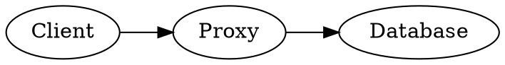
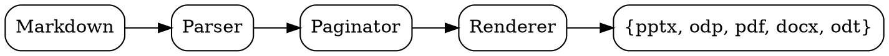

# Quick start

## One command, five formats

You wrote Markdown. md2any turns it into a polished deliverable — slides, documents, or PDF — without spawning Office, calling a JRE, or running a Python pipeline.

```bash
md2any talk.md                 # → talk.pptx (PowerPoint)
md2any talk.md -o talk.odp     # → talk.odp  (LibreOffice Impress)
md2any talk.md -o talk.pdf     # → talk.pdf  (PDF 1.7)
md2any talk.md -o talk.docx    # → talk.docx (Microsoft Word)
md2any talk.md -o talk.odt     # → talk.odt  (LibreOffice Writer)
```

One Rust binary. No runtime dependencies. Cross-platform.

## Self-documenting

This deck is the embedded user manual. Regenerate it in any format, any layout, any theme:

```bash
md2any --help-pptx                       # this deck → md2any-help.pptx
md2any --help-pdf --theme dark           # dark PDF
md2any --help-odp --layout studio        # studio layout, ODP
md2any --help-docx                       # → Word document
md2any --help-odt                        # → LibreOffice Writer document
md2any --help-md > HELP.md               # raw markdown source
```

Every `--help-*` flag respects every other flag.

# Anatomy of a deck

## Pagination rules

md2any turns Markdown headings into slides. Memorize three rules:

- The first `# H1` (or the front-matter `title`) becomes the **title slide**
- Every subsequent `# H1` becomes a **section divider**
- Every `## H2` starts a **content slide**
- A horizontal rule `---` forces a slide break without changing the title
- `### H3` and deeper render as inline headings on the current slide

Long content auto-paginates into `(cont.)` slides. Lists with more than 12 items wrap into two columns automatically (except in portrait mode). Pagination is skipped in DOCX/ODT — those formats flow continuously and let the consumer paginate.

## Front matter

Put YAML between `---` fences at the top of the file.

```yaml
---
title: My Talk
subtitle: A subtitle for the title slide
author: Your Name
date: auto              # or 2026-05-23, or "today"
theme: light            # light | dark
aspect: 16:9            # see "Aspect ratios" below for all presets,
                        # or `WxH[unit]` e.g. 1920x1080, 300x200mm, 13.3x7.5in
layout: clean           # clean | studio | frame | bold
font: Inter             # any installed font (PPTX/ODP/DOCX/ODT)
logo: brand.png         # rendered in slide footer
toc: true               # inject a Contents slide after the title
transition: fade        # none | fade | push | wipe | cover | split
transition_duration: 0.6  # seconds
direction: ltr          # ltr | rtl
---
```

Every key is optional. CLI flags override front matter; front matter overrides defaults.

# Markdown reference

## Inline formatting

The usual:

- `**bold**` → **bold**
- `*italic*` → *italic*
- `` `inline code` `` → `inline code`
- `~~strikethrough~~` → ~~strikethrough~~
- `[link text](url)` → [link text](https://example.com) — **clickable in every format**

All five output formats render these natively — no HTML, no extension.

## Lists

Nested up to nine levels. Numbered and bulleted lists are independent.

- First level item
- Second top-level item
  - Nested item
  - Another nested item
    - Triple-nested
- Back to level 1

```markdown
1. Step one
2. Step two
   1. Sub-step
   2. Another sub-step
3. Step three
```

If a list has more than 12 items, md2any auto-flows it into two columns (slide output only).

## Code blocks

Fenced code blocks pick up syntax highlighting from the language tag. Twenty languages built in:

- Mainstream: `rust`, `python`, `js` / `ts`, `go`, `c` / `cpp`, `java`, `ruby`, `bash`, `sql`
- Data: `json`, `yaml`, `toml`
- Markup: `html`, `xml`, `css`
- Mainframe: `cobol`, `jcl`, `rexx`, `pli`, `hlasm`, `db2`

## Code blocks (continued)

A bare fence picks the language only:

````
```rust
fn main() { println!("hi"); }
```
````

Add a filename after the language and md2any renders a header bar:

````
```rust src/main.rs
fn main() { println!("hi"); }
```
````

Code blocks longer than five lines get line numbers automatically.

## Tables

GitHub-flavored Markdown tables. Banded rows, accent-colored header.

| Column | Type | Notes |
|--------|------|-------|
| name   | text | first column |
| size   | int  | second column |
| active | bool | third column |

Alignment hints (`:--`, `:-:`, `--:`) parse but render as left for now.

## Side-by-side columns

Put `:::` on a line by itself to split a slide into two columns:

```markdown
## Pros and cons

Left side content goes here. Bullets, paragraphs, code, all work.

:::

Right side content. Independently paginated.
```

In slide output both columns scale to fit. In document output (DOCX/ODT) columns flatten into back-to-back blocks.

## Blockquotes

Render with a vertical accent bar and italic body text.

> The best presentation tool is the one that gets out of your way.
>
> Plain text in, polished slides out. That's the whole product.

## Math

Inline `$...$` and display `$$...$$` math translate a useful subset of LaTeX to Unicode at parse time. No TeX engine, no `mathjax`, no extra binary — pure Rust pattern matching that turns common notation into the corresponding Unicode characters.

```markdown
Einstein wrote $E = mc^2$.

$$\sum_{i=1}^{n} i = \frac{n(n+1)}{2}$$
```

The next twelve slides walk through every construct md2any understands, with source on the left and what it renders to on the right.

## Math — Greek letters

| Source       | Renders as | Source       | Renders as |
|--------------|------------|--------------|------------|
| `$\alpha$`   | $\alpha$   | `$\nu$`      | $\nu$      |
| `$\beta$`    | $\beta$    | `$\xi$`      | $\xi$      |
| `$\gamma$`   | $\gamma$   | `$\pi$`      | $\pi$      |
| `$\delta$`   | $\delta$   | `$\rho$`     | $\rho$     |
| `$\epsilon$` | $\epsilon$ | `$\sigma$`   | $\sigma$   |
| `$\zeta$`    | $\zeta$    | `$\tau$`     | $\tau$     |
| `$\eta$`     | $\eta$     | `$\upsilon$` | $\upsilon$ |
| `$\theta$`   | $\theta$   | `$\phi$`     | $\phi$     |
| `$\iota$`    | $\iota$    | `$\chi$`     | $\chi$     |
| `$\kappa$`   | $\kappa$   | `$\psi$`     | $\psi$     |
| `$\lambda$`  | $\lambda$  | `$\omega$`   | $\omega$   |
| `$\mu$`      | $\mu$      | `$\aleph$`   | $\aleph$   |

Uppercase forms work the same way: `$\Gamma$` → $\Gamma$, `$\Delta$` → $\Delta$, `$\Theta$` → $\Theta$, `$\Lambda$` → $\Lambda$, `$\Xi$` → $\Xi$, `$\Pi$` → $\Pi$, `$\Sigma$` → $\Sigma$, `$\Phi$` → $\Phi$, `$\Psi$` → $\Psi$, `$\Omega$` → $\Omega$.

## Math — big operators

| Source         | Renders as     |
|----------------|----------------|
| `$\sum$`       | $\sum$         |
| `$\prod$`      | $\prod$        |
| `$\int$`       | $\int$         |
| `$\oint$`      | $\oint$        |
| `$\bigcup$`    | $\bigcup$      |
| `$\bigcap$`    | $\bigcap$      |
| `$\sum_{i=1}^{n} i$` | $\sum_{i=1}^{n} i$ |
| `$\int_a^b f(x) dx$` | $\int_a^b f(x) dx$ |
| `$\prod_{k=1}^{n} k$` | $\prod_{k=1}^{n} k$ |

Subscripts and superscripts after a big operator render as small adjacent glyphs (no stacked above/below — that needs a real TeX engine).

## Math — relations

| Source       | Renders as | Source        | Renders as  |
|--------------|------------|---------------|-------------|
| `$\leq$`     | $\leq$     | `$\equiv$`    | $\equiv$    |
| `$\geq$`     | $\geq$     | `$\sim$`      | $\sim$      |
| `$\neq$`     | $\neq$     | `$\simeq$`    | $\simeq$    |
| `$\approx$`  | $\approx$  | `$\propto$`   | $\propto$   |

```markdown
$a \leq b \neq c \approx d \propto e$
```

Renders as: $a \leq b \neq c \approx d \propto e$

## Math — arrows

| Source              | Renders as          |
|---------------------|---------------------|
| `$\to$`             | $\to$               |
| `$\rightarrow$`     | $\rightarrow$       |
| `$\leftarrow$`      | $\leftarrow$        |
| `$\Rightarrow$`     | $\Rightarrow$       |
| `$\Leftarrow$`      | $\Leftarrow$        |
| `$\leftrightarrow$` | $\leftrightarrow$   |
| `$\Leftrightarrow$` | $\Leftrightarrow$   |
| `$\mapsto$`         | $\mapsto$           |

Use the capitalised forms (`\Rightarrow`, `\Leftrightarrow`) for logical implication; the lowercase forms are for set membership / function notation.

## Math — set and logic

| Source        | Renders as | Source         | Renders as  |
|---------------|------------|----------------|-------------|
| `$\in$`       | $\in$      | `$\forall$`    | $\forall$   |
| `$\notin$`    | $\notin$   | `$\exists$`    | $\exists$   |
| `$\subset$`   | $\subset$  | `$\nexists$`   | $\nexists$  |
| `$\subseteq$` | $\subseteq$| `$\emptyset$`  | $\emptyset$ |
| `$\supset$`   | $\supset$  | `$\land$`      | $\land$     |
| `$\supseteq$` | $\supseteq$| `$\lor$`       | $\lor$      |
| `$\cup$`      | $\cup$     | `$\lnot$`      | $\lnot$     |
| `$\cap$`      | $\cap$     | `$\setminus$`  | $\setminus$ |

```markdown
$\forall x \in \mathbb{N}, \exists y : y > x$
```

Renders as: $\forall x \in \mathbb{N}, \exists y : y > x$

## Math — super and subscripts

| Source            | Renders as        |
|-------------------|-------------------|
| `$x^2$`           | $x^2$             |
| `$a_i$`           | $a_i$             |
| `$x^{n+1}$`       | $x^{n+1}$         |
| `$a_{ij}$`        | $a_{ij}$          |
| `$a_{ij}^{k+1}$`  | $a_{ij}^{k+1}$    |
| `$e^{i\pi}$`      | $e^{i\pi}$        |
| `$\sigma_x$`      | $\sigma_x$        |

A single character following `^` or `_` is the superscript / subscript; for multi-character groups wrap them in `{…}`.

## Math — fractions, roots, binomials

| Source                | Renders as            |
|-----------------------|-----------------------|
| `$\frac{a}{b}$`       | $\frac{a}{b}$         |
| `$\frac{1}{1-r}$`     | $\frac{1}{1-r}$       |
| `$\sqrt{x}$`          | $\sqrt{x}$            |
| `$\sqrt{a^2 + b^2}$`  | $\sqrt{a^2 + b^2}$    |
| `$\binom{n}{k}$`      | $\binom{n}{k}$        |

```markdown
$\frac{-b \pm \sqrt{b^2 - 4ac}}{2a}$
```

Renders as: $\frac{-b \pm \sqrt{b^2 - 4ac}}{2a}$

Fractions and roots render inline (no horizontal bar above the fraction, no extended radical sign). They read clearly but won't match a paper textbook visually — see "limitations" below.

## Math — operator names

LaTeX `\log` / `\sin` / etc. don't exist as Unicode characters; they're typeset as roman text inside math. md2any preserves them as plain ASCII with a trailing space so multiplication doesn't merge them with their argument.

| Source             | Renders as           |
|--------------------|----------------------|
| `$\log n$`         | $\log n$             |
| `$\ln x$`          | $\ln x$              |
| `$\sin \theta$`    | $\sin \theta$        |
| `$\cos \theta$`    | $\cos \theta$        |
| `$\tan \theta$`    | $\tan \theta$        |
| `$\max(a, b)$`     | $\max(a, b)$         |
| `$\min(a, b)$`     | $\min(a, b)$         |
| `$\lim_{x \to 0}$` | $\lim_{x \to 0}$     |
| `$\exp(x)$`        | $\exp(x)$            |
| `$\det A$`         | $\det A$             |
| `$\gcd(a, b)$`     | $\gcd(a, b)$         |

Also recognised: `\sec` `\csc` `\cot` `\sinh` `\cosh` `\tanh` `\arcsin` `\arccos` `\arctan` `\lg` `\sup` `\inf`.

## Math — delimiters and spacing

`\left( ... \right)` and `\big[ ... \Big|` style macros normally tell TeX to grow the delimiter to match its contents. md2any has no glyph stacker, so these macros collapse to *nothing* and the bare delimiter that follows renders at the body size. Equations still read correctly; they just don't grow.

| Source                          | Renders as                      |
|---------------------------------|---------------------------------|
| `$\left( x + y \right)$`        | $\left( x + y \right)$          |
| `$\big[ a, b \big]$`            | $\big[ a, b \big]$              |
| `$\Big\| \vec{v} \Big\|$`       | $\Big| \vec{v} \Big|$           |

Spacing macros map to ASCII space approximations: `\quad` → two spaces, `\qquad` → four, `\,` / `\:` / `\;` → thin space, `\!` → no-op.

## Math — dots and ellipses

| Source         | Renders as |
|----------------|------------|
| `$\ldots$`     | $\ldots$   |
| `$\cdots$`     | $\cdots$   |
| `$\vdots$`     | $\vdots$   |
| `$\ddots$`     | $\ddots$   |

```markdown
$x_1, x_2, \ldots, x_n$
$x_1 + x_2 + \cdots + x_n$
```

Render as: $x_1, x_2, \ldots, x_n$ and $x_1 + x_2 + \cdots + x_n$.

## Math — what md2any is *not*

The math support is intentionally shallow. If you need any of the following, render the formula with a real TeX engine and embed it as a PNG via the regular image syntax.

- **No stacked fractions** — `\frac{}{}` becomes inline `(a)/(b)`, not the textbook two-line form with a horizontal bar.
- **No proper radical bars** — `\sqrt{}` becomes `√(...)`, not a glyph with an extended bar over the radicand.
- **No matrices** — `\begin{matrix} ... \end{matrix}` and friends are not parsed.
- **No aligned equations** — each `$$...$$` block is one visual row; multi-line `\\` alignment isn't supported.
- **No equation numbering** — there's no `\label` / `\ref` mechanism.
- **No `\vec` accents** — the macro isn't recognised; write the letter directly or use Unicode (`v⃗`).

Everything *not* on that list works, and what works is enough for typical talk-deck math: equations, summations, integrals, set notation, predicate logic. For deeper notation, the image-embed escape hatch keeps your options open without bloating md2any.

## Math — copy-paste from PDF

PDF text is copy-pasteable. md2any writes a `/ToUnicode` CMap with every embedded font, so selecting a formula in your PDF reader gives you back real Unicode characters — not glyph indices, not Latin substitutes.

Try it: open the manual PDF, select `∑ᵢ₌₁ⁿ xᵢ²` from any math slide, paste somewhere. You'll get the actual Unicode characters back.

This works for every glyph in every face: Greek, math operators, sub/superscripts, the CJK fallback if you passed `--cjk`, the line-drawing characters in the Unicode coverage slide.

## Diagrams

Code fences with `dot`, `graphviz`, `mermaid`, or `plantuml` shell out to the matching CLI tool if it's on `$PATH` and embed the rendered PNG. If the tool isn't installed, the source stays as a regular code block.

````

````

## Footnotes

Markdown footnotes (`[^id]`) render as superscript ¹²³ in the body, with definitions collected at the bottom of the slide where they were referenced.

```markdown
Rust was first released in 2015[^rust].

[^rust]: Originally a personal project by Graydon Hoare at Mozilla.
```

## Horizontal rules

A line containing just `---` forces a slide break while keeping the current section title. Use it for long sections that need to split across slides without introducing a new H2.

## Images

Standard markdown image syntax works in every output format:

```markdown


```

Three sources, one syntax:

- **Local PNG / JPEG** — resolved relative to the markdown file, embedded as-is.
- **Remote URL** (`http://` or `https://`) — fetched at build time with a 10 s timeout, capped at 20 MB per image, and cached after a successful download. The default cache location follows the host OS convention: `%LOCALAPPDATA%` on Windows, `~/Library/Caches` on macOS, and `$XDG_CACHE_HOME` / `~/.cache` on Linux and other Unix systems.
- **SVG** — rasterised to PNG via the bundled resvg engine at 192 DPI (2× retina), then embedded the same way as a regular raster image. Text in SVGs uses md2any's bundled DejaVu Sans family so renders look identical regardless of what's installed on the build machine.

Aspect ratio is preserved; the slide layout decides how much room each image gets.

### Sizing — `{width=N%}`

Append a Pandoc-style attribute to set the image to a fraction of the content column (slide formats only — DOCX/ODT defer to the consumer app):

```markdown
{width=50%}
{width=20%}
```

Valid range is 1–100. Unrecognised attributes are ignored silently. Without the attribute, the image fills the content column at its native aspect ratio.

### Two-column image layouts

Two layout directives place a single image alongside the rest of the slide content:

```markdown
## Architecture

<!-- layout: image-left -->


Walks the request through the API gateway, then the service mesh,
then into the database tier. Each hop is observable via OpenTelemetry.
```

`<!-- layout: image-left -->` puts the image on the left and everything else on the right. `<!-- layout: image-right -->` does the opposite. The directive triggers only when the slide has exactly one image; otherwise it's ignored.

Remote-image cache controls:

```bash
md2any talk.md -o talk.pdf
md2any talk.md --remote-image-cache ./.md2any-cache -o talk.pdf
md2any talk.md --no-remote-image-cache -o talk.pdf
md2any talk.md --remote-image-user-agent "my-build/1.0" -o talk.pdf
```

Remote fetches retry transient failures (HTTP 408 / 429 / 500 / 502 / 503 / 504, network errors) up to three times with capped exponential backoff (max 30 s per wait), honouring `Retry-After` in both delta-seconds and HTTP-date forms. If your binary was compiled without the `remote-images` feature, `http://` and `https://` image references fail with a clear error; local images still work.

**On failure: placeholder instead of abort.** If an image can't be loaded — network failure, 404, garbage body, file missing, payload over the 20 MB cap, broken SVG — md2any prints a one-line stderr warning naming the source and the reason, then substitutes a red "Image failed to load" placeholder that includes the URL and error text. The render completes; you ship a deck where every missing-image slot is visibly flagged rather than discovering the failure when a viewer opens the file. CI pipelines can grep stderr for `warning: image failed` to surface the issue without failing the build.

**Cache retention.** Remote images are fetched once and reused on every subsequent render — there's no expiry and no conditional `If-Modified-Since` / `ETag` round-trip. If a remote image gets updated upstream, you'll keep seeing the old version until you delete the cache file. The default cache directory follows the platform convention; `md2any doctor` prints the resolved path. Clearing is just `rm -rf <cache-dir>/remote-images/`. The cap is 20 MB per image; oversized payloads trip the placeholder substitution above instead of silently truncating.

## Per-slide background

An HTML comment with `bg:` sets a full-bleed background image for the current slide.

```markdown
# Hero slide

<!-- bg: photos/hero.jpg -->

A statement.
```

Images load relative to the deck file. Background propagates through `(cont.)` continuation slides.

# Layouts

## Four ways to dress a deck

Same Markdown, different visual treatment:

- `clean` — minimal title underline + full-bleed content (default)
- `studio` — vertical accent rail, italic titles, big background numerals on sections
- `frame` — left sidebar carries deck title + slide number; content on the right
- `bold` — full-width accent block behind every title

Pick with `--layout NAME` or set `layout:` in front matter.

## When to use which

**clean** for talks where content should dominate. Minimal chrome.

**studio** for editorial / design-review decks. Italics, rails, big numerals. Looks serious without being heavy.

:::

**frame** for long training and onboarding decks where a persistent reference panel helps the audience.

**bold** for keynote-style events. Every section transition feels intentional. Maximum accent color.

# Themes

## Light vs dark

Two carefully-tuned palettes. Every layout supports both.

**Light theme**

White background, slate text, sky-blue accent. Reads well in bright rooms, prints cleanly.

```
--theme light    (default)
```

:::

**Dark theme**

Slate-900 background, frost-bright accent. Reads well on stage, easier on the eyes during long talks.

```
--theme dark
```

## Custom palettes

For brand-specific decks, override colors, fonts, and sizes with a YAML overlay. Pass it with `--theme-file PATH`. The overlay merges on top of whatever `--theme` selects (default `light`); only the keys you set are changed.

```bash
md2any talk.md --theme-file brand.yaml -o talk.pdf
```

Hex colours accept `#RRGGBB` or bare `RRGGBB`. Sizes are in hundredths of a typographic point (so `1800` = 18 pt). Font names must exist on the consumer's machine for PPTX/ODP/DOCX/ODT; PDF always uses bundled DejaVu and ignores font overrides.

## --theme-file — colour keys

| Key            | Role                           | Light default | Dark default |
|----------------|--------------------------------|---------------|--------------|
| `bg`           | Slide background               | `#FFFFFF`     | `#0B1220`    |
| `title_color`  | Slide title text               | `#0F172A`     | `#F8FAFC`    |
| `body_color`   | Body / paragraph text          | `#334155`     | `#CBD5E1`    |
| `muted_color`  | Footer, captions, slide number | `#94A3B8`     | `#64748B`    |
| `accent`       | Underline bar, links, ✓ markers| `#0EA5E9`     | `#38BDF8`    |
| `accent_soft`  | Tag chips, code-fence label bg | `#E0F2FE`     | `#0C4A6E`    |
| `divider`      | Hairline rule under titles     | `#E2E8F0`     | `#1E293B`    |
| `code_bg`      | Code block fill                | `#F1F5F9`     | `#111A2E`    |
| `code_text`    | Code text (when not tokenised) | `#1E293B`     | `#E2E8F0`    |
| `code_accent`  | Inline `code` text             | `#0369A1`     | `#7DD3FC`    |
| `section_bg`   | Section-divider slide fill     | `#0F172A`     | `#0EA5E9`    |
| `section_text` | Section-divider slide text     | `#F8FAFC`     | `#FFFFFF`    |
| `link`         | Hyperlink text                 | `#0EA5E9`     | `#7DD3FC`    |
| `on_accent`    | Text drawn over `accent`       | `#FFFFFF`     | `#0B1220`    |

## --theme-file — fonts and sizes

| Key           | Role                                | Default (16:9)    |
|---------------|-------------------------------------|-------------------|
| `title_font`  | Title bar / heading typeface        | `Calibri Light`   |
| `body_font`   | Paragraph + list typeface           | `Calibri`         |
| `mono_font`   | Code / inline-code typeface         | `Consolas`        |
| `title_size`  | Title size, hundredths of pt        | `2800` (28 pt)    |
| `body_size`   | Body size, hundredths of pt         | `1800` (18 pt)    |
| `code_size`   | Code-block size, hundredths of pt   | `1500` (15 pt)    |
| `hero_size`   | Title-slide hero text, hundredths   | `5400` (54 pt)    |

Portrait aspects (9:16, A4, A5, Letter) ship slightly smaller defaults: `2400 / 1700 / 1400 / 4200`.

## --theme-file — syntax highlighting

Nested under a `syntax:` key. Each value is a hex colour applied to that token class across every supported language.

| Key         | Role                              | Light default | Dark default |
|-------------|-----------------------------------|---------------|--------------|
| `keyword`   | `fn`, `class`, `SELECT`, etc.     | `#9333EA`     | `#C792EA`    |
| `string`    | String + char literals            | `#16A34A`     | `#C3E88D`    |
| `number`    | Numeric + boolean literals        | `#C2410C`     | `#FFCB6B`    |
| `comment`   | Line + block comments             | `#94A3B8`     | `#6B7B8E`    |
| `function`  | Function and method names         | `#2563EB`     | `#82AAFF`    |
| `type`      | Type names, capitalised idents    | `#0891B2`     | `#FFC777`    |
| `attribute` | Decorators, `#[derive]`, JSX attr | `#DC2626`     | `#F78C6C`    |

## --theme-file — full example

```yaml
# brand.yaml — a complete overlay touching every category
bg:           "#FFFCF7"
title_color:  "#0A0A23"
body_color:   "#1F2937"
muted_color:  "#9CA3AF"
accent:       "#FF6B35"
accent_soft:  "#FFE4D6"
divider:      "#E5E0D5"
code_bg:      "#F5F0E6"
code_text:    "#1F2937"
code_accent:  "#B8410B"
section_bg:   "#0A0A23"
section_text: "#FFFCF7"
link:         "#B8410B"
on_accent:    "#FFFCF7"

title_font: "Inter"
body_font:  "Inter"
mono_font:  "JetBrains Mono"

title_size: 3000
body_size:  1900
code_size:  1500
hero_size:  5800

syntax:
  keyword:   "#D946EF"
  string:    "#15803D"
  number:    "#B8410B"
  comment:   "#9CA3AF"
  function:  "#1D4ED8"
  type:      "#0E7490"
  attribute: "#BE123C"
```

Set only the keys you want to change — anything omitted inherits from the underlying `--theme`.

# Aspect ratios

## Five flavors

| Flag value         | Dimensions (mm)    | Dimensions (in)   | Use for                                  |
|--------------------|--------------------|-------------------|------------------------------------------|
| `16:9`             | 338.7 × 190.5 mm   | 13.33″ × 7.5″     | Modern projectors and screens (default)  |
| `4:3`              | 254 × 190.5 mm     | 10″ × 7.5″        | Legacy projectors                        |
| `9:16`             | 190.5 × 338.7 mm   | 7.5″ × 13.33″     | Vertical / phone-shaped                  |
| `a4`               | 210 × 297 mm       | 8.27″ × 11.69″    | A4 portrait (ISO 216)                    |
| `a4-landscape`     | 297 × 210 mm       | 11.69″ × 8.27″    | A4 landscape                             |
| `a3`               | 297 × 420 mm       | 11.69″ × 16.54″   | A3 portrait                              |
| `a5`               | 148 × 210 mm       | 5.83″ × 8.27″     | A5 portrait                              |
| `letter`           | 215.9 × 279.4 mm   | 8.5″ × 11″        | US Letter portrait (ANSI A)              |
| `letter-landscape` | 279.4 × 215.9 mm   | 11″ × 8.5″        | US Letter landscape                      |
| `legal`            | 215.9 × 355.6 mm   | 8.5″ × 14″        | US Legal                                 |
| `tabloid`          | 279.4 × 431.8 mm   | 11″ × 17″         | Tabloid / ANSI B                         |

## Custom dimensions

Anything that isn't a preset is parsed as `WIDTHxHEIGHT[unit]`. Plain numbers
with no suffix are pixels at 96 DPI.

```bash
md2any deck.md --aspect 1920x1080         # pixels at 96 DPI (default unit)
md2any deck.md --aspect 1920x1080px       # explicit px
md2any deck.md --aspect 300x200mm         # millimetres
md2any deck.md --aspect 30x20cm           # centimetres
md2any deck.md --aspect 13.33x7.5in       # inches
md2any deck.md --aspect 960x540pt         # PostScript points
md2any deck.md --aspect 12192000x6858000emu   # raw EMU
```

Decimal fractions are fine. Width and height can be in any order — md2any
treats `H > W` as portrait and adjusts typography accordingly.

Portrait layouts adjust typography automatically — smaller titles, narrower content area, single-column lists.

# Output formats

## Five formats, one binary

| Format | Extension | Opens in | Editable? |
|--------|-----------|----------|-----------|
| PowerPoint | `.pptx` | PowerPoint, Keynote, LibreOffice Impress, Google Slides | yes |
| OpenDocument Impress | `.odp` | LibreOffice Impress, Keynote, Slides | yes |
| PDF | `.pdf` | Anything that opens PDFs | no |
| Microsoft Word | `.docx` | Word, LibreOffice Writer, Google Docs, Pages | yes |
| OpenDocument Writer | `.odt` | LibreOffice Writer, Word, Google Docs | yes |

All five produced natively in pure Rust. No PDF library, no Office spawn, no external converter.

## Slides vs documents

The five formats split into two families.

**Slide formats** — `pptx`, `odp`, `pdf` — paginate one slide per page using the deck's aspect ratio. Each `# H1` is a section divider; each `## H2` starts a new slide. Long content auto-flows into `(cont.)` slides.

**Document formats** — `docx`, `odt` — flow continuously. Same source markdown produces a flowing document: title page, then each `# H1` as a Heading 1 (with a page break), each `## H2` as Heading 2, and all body content as flowing paragraphs/lists/tables. Use these to produce the printed companion or handout for a deck.

## When to use which

**PPTX** when someone needs to edit the slides. Native OOXML; opens everywhere.

**ODP** when you're all-in on LibreOffice or want smaller files (~⅓ the size of PPTX). Same render quality.

**PDF** when the deck needs to look identical on every machine. md2any
embeds DejaVu Sans + DejaVu Sans Mono inside the binary and into every
PDF, so output renders identically in every reader regardless of installed
fonts. Speaker notes are dropped.

**DOCX** to hand someone the deck's contents as a Word document — for marking up, commenting, or printing as a handout.

**ODT** when your collaborator uses LibreOffice Writer, or when you want the smallest editable document format.

## Switching formats

The format auto-detects from the output extension:

```bash
md2any talk.md -o slides.pdf       # PDF
md2any talk.md -o slides.odp       # ODP
md2any talk.md -o slides.pptx      # PPTX
md2any talk.md -o paper.docx       # Word document
md2any talk.md -o paper.odt        # LibreOffice Writer
```

Or set it explicitly with `--format`:

```bash
md2any talk.md --format pdf
md2any talk.md --format docx --output /tmp/handout.docx
```

# Handout mode

## N-up printable PDF

`--handout N` (where N is 2, 4, or 6) produces an A4-portrait PDF with N slides per page. Use it to print a take-away after the talk.

```bash
md2any talk.md --handout 4 -o talk-handout.pdf
```

Slides become numbered thumbnails on the page. Layout, theme, and transitions remain untouched.

# Workflow

## Watch mode

`--watch` rebuilds the output every time the source changes. Pair with the file watcher in your editor for a live-rebuild loop:

```bash
md2any talk.md -o talk.pdf --watch
```

## Live preview server

`--serve` starts a tiny HTTP server on `localhost:8421` that hosts the PDF with auto-reload. Open the URL once, then just keep editing — the browser tab refreshes within ~500 ms of every save.

```bash
md2any talk.md --serve --port 9000
```

No frontend dependencies. Pure std HTTP.

## Linting

`--check` parses and paginates without writing output, then prints warnings about likely visual issues — long titles, narrow tables, code that won't fit, lists that pile too high. Exits with code 2 if any warnings.

```bash
md2any talk.md --check
```

Useful in CI to catch decks that will render poorly before you ship them.

## Scaffolding

`md2any new talk.md` writes a starter deck with sensible front matter and a few example slides — front matter, title slide, section divider, content slide with a code block and a table.

```bash
md2any new keynote.md
md2any new keynote.md --force      # overwrite an existing file
```

## Multi-file decks

Pass multiple markdown files; they concatenate in order, with front matter from the first.

```bash
md2any intro.md body.md outro.md -o talk.pptx
```

Useful for very large decks where one file per section keeps editing manageable.

## Stdin

Pass `-` as the input to read from stdin:

```bash
cat draft.md | md2any - -o /tmp/preview.pdf
some-generator | md2any - --format docx > /tmp/auto.docx
```

# Command-line reference

## Every flag

```
md2any <INPUT...> [OPTIONS]
md2any new <PATH>          Write a starter markdown file with example structure
md2any doctor              Probe optional CLIs, bundled fonts, build features
md2any licenses            Print the bundled-font licence notice

  -o, --output <PATH>      Output file (default: from -o extension, else input.pptx)
      --format <NAME>      pptx | odp | pdf | docx | odt
      --theme <NAME>       light | dark
      --aspect <RATIO>     16:9 | 4:3 | 9:16 | a4[-landscape] | a3 | a5 |
                           letter[-landscape] | legal | tabloid |
                           WxH[unit] custom (px / mm / cm / in / pt / emu)
      --layout <NAME>      clean | studio | frame | bold
      --title <STRING>     Override deck title
      --author <STRING>    Override deck author
      --font <NAME>        Override body / title font (PPTX/ODP/DOCX/ODT)
      --logo <PATH>        Logo image rendered in slide footer
      --remote-image-cache <PATH>
                           Directory used to cache http(s) image downloads
                           (default: platform cache directory)
      --no-remote-image-cache
                           Fetch http(s) images on every render
      --remote-image-user-agent <STRING>
                           User-Agent sent when fetching remote images
      --theme-file <PATH>  YAML colour/font/size overlay
      --handout <N>        PDF only: 2/4/6 slides per A4 portrait page
      --with-notes         PDF only: emit one A4 page per slide with
                           the thumbnail + speaker notes underneath
      --cjk <PATH>         PDF only: TTF/OTF font used as per-character
                           fallback when DejaVu can't render a glyph
                           (typically a Noto CJK or system CJK font)
      --watch              Watch the markdown input file(s) and rebuild on change
                           (external deps like images / theme-file / logo are
                           not tracked — restart if those change)
      --serve              Start localhost HTTP preview with hot reload
      --port <N>           Port for --serve (default 8421)
      --check              Lint mode; exit code 2 if any warnings
      --outline            Print one-line-per-slide outline (page, kind, blocks,
                           title) and exit. No output file is written.
  -q, --quiet              Suppress summary line
  -h, --help               Print this brief help
      --help-pptx          Generate the user manual as PPTX
      --help-odp           Generate the user manual as ODP
      --help-pdf           Generate the user manual as PDF
      --help-docx          Generate the user manual as Word DOCX
      --help-odt           Generate the user manual as LibreOffice ODT
      --help-md            Print the user-manual Markdown source to stdout
  -V, --version            Print version
```

## Combining flags

The `--help-*` flags respect every other flag.

```bash
md2any --help-pdf --theme dark --layout studio
md2any --help-pptx --aspect 9:16
md2any --help-odt --theme-file brand.yaml -o brand-manual.odt
md2any --help-md | head -100
```

Same is true for normal runs — every flag composes with every other.

# Speaker notes

## How to attach notes

Put an HTML comment starting with `notes:` or `speaker notes:` anywhere on the slide:

```markdown
## A slide title

Visible content here.

<!-- notes: Reminder to reference the Q3 numbers and pause for questions. -->
```

Multiple `<!-- notes: -->` comments on one slide are concatenated.

Notes attach in **PPTX** and **ODP** outputs (visible in Presenter View or printed as Notes Pages). DOCX and ODT outputs drop them.

For PDF, pass `--with-notes` to produce a presenter-friendly companion document: one A4 portrait page per slide with the slide thumbnail at the top and the speaker notes laid out below.

```bash
md2any talk.md --with-notes -o talk-notes.pdf
```

Mutually exclusive with `--handout` — pick one PDF post-processor at a time.

# Transitions

## Animated section changes

Set a deck-wide transition in front matter:

```yaml
transition: fade
transition_duration: 0.6
```

Supported across PPTX, ODP, and PDF: `fade`, `push`, `wipe`, `cover`, `split`. DOCX and ODT ignore transitions (they're documents, not slides).

# Internationalisation

## Right-to-left

```yaml
direction: rtl
```

Flips paragraph alignment and adds `rtl="1"` markers throughout PPTX and
ODP output for Arabic, Hebrew, and other RTL scripts. PDF output now
embeds DejaVu Sans, which covers Arabic, Hebrew, and other complex
scripts at the glyph level; full bidirectional reordering and joining
behaviour still depends on the viewer's PDF text layout engine.

## CJK fonts

For **PPTX / ODP / DOCX / ODT**, pass `--font` (or set `font:` in front matter) to a CJK-capable typeface — `Noto Sans CJK SC`, `Microsoft YaHei`, `Hiragino Sans`, `Yu Gothic`, etc. The slide consumer renders with that font, so Chinese / Japanese / Korean characters pass through unchanged.

For **PDF**, point `--cjk` at any TrueType or OpenType CJK font on disk and md2any uses it as a per-character fallback whenever DejaVu Sans can't render a glyph:

```bash
md2any talk.md -o talk.pdf \
    --cjk /usr/share/fonts/opentype/noto/NotoSansCJK-Regular.ttc
```

Only the glyphs your deck actually uses are embedded (subsetting handles the rest), so a 20 MB Noto CJK source typically turns into a small KB-scale addition to the output PDF.

# Performance

## How fast is fast

| Deck size  | PPTX  | ODP   | DOCX  | ODT   | PDF    |
|------------|-------|-------|-------|-------|--------|
| 30 slides  | ~1 ms | ~1 ms | ~1 ms | ~1 ms | ~5 ms  |
| 100 slides | ~3 ms | ~2 ms | ~2 ms | ~2 ms | ~12 ms |
| 1000 slides | ~30 ms | ~25 ms | ~20 ms | ~20 ms | ~120 ms |

Numbers from a commodity x86-64. PDF is slower than PPTX/ODP/DOCX/ODT because of PNG decode and per-token text positioning.

Cold start is dominated by binary load, not parsing.

# Limitations

## What md2any is *not*

md2any is a focused artifact generator, not a general-purpose document toolchain. If your needs go beyond the list below, you probably want a different tool:

- **Not Pandoc.** No `--from`/`--to` arbitrary format conversion, no Lua filters, no templating engine, no bibliography/citation handling, no cross-reference tracking, no extension-rich Markdown dialects (CommonMark + GFM tables + the small md2any-specific directives are the whole grammar).
- **Not Quarto.** No literate execution, no R/Python/Julia code execution at build time, no notebook ingestion, no website / book project structure, no observable cells.
- **Not a TeX engine.** Math support is the Unicode subset documented in the Math reference — no stacked fractions, no matrix environments, no aligned equations, no equation numbering.
- **Not a layout DSL.** Per-slide layout has a couple of opt-in directives; if you need fine-grained per-element positioning, build the deck in PowerPoint or Keynote directly.

Pandoc is the general converter. Quarto is a publishing system. md2any is a one-binary artifact generator for the narrower case of "I have one Markdown file and I want all five common deliverable formats out the other side."

## What's not supported

- GIF and WebP images (PNG, JPEG, and SVG are supported)
- Embedded HTML beyond the notes / bg / column-break / layout directives
- Speaker notes inside DOCX / ODT (PPTX / ODP attach them natively; PDF gets them via `--with-notes`)
- Custom font embedding in PDF — `--font` is honoured for PPTX / ODP / DOCX / ODT only; PDF always uses bundled DejaVu Sans + an optional `--cjk` fallback
- Citations / bibliographies / cross-references — no `[@cite]` parsing, no `\ref{}`, no auto-generated reference list
- Diagram rendering requires the corresponding CLI on `$PATH` (`dot` / `mmdc` / `plantuml`). When absent, the fence stays as a regular code block — md2any never bundles diagram engines
- DOCX / ODT are flowing documents, not slide carriers. Section breaks come from H1; everything else flows. Pagination is the consumer app's job

## Honest tradeoffs in PDF

PDF output uses DejaVu Sans + DejaVu Sans Mono, embedded inside the md2any binary (~3 MB of the binary footprint). This buys Unicode coverage across Greek, Cyrillic, math operators, sub/superscripts, and most of European Latin without depending on the viewer's installed fonts. Other font families (Calibri etc.) are not bundled; `--font` is honoured for PPTX/ODP/DOCX/ODT but not for PDF.

Font subsetting is automatic — each PDF embeds only the glyphs that deck actually uses, not the full 3 MB face. This manual (135 slides, heavy on tables and math) lands under 400 KB; a typical talk-sized deck is well under 200 KB even with code, tables, and the full Greek / math toolbox.

Inline code in PDF is rendered with DejaVu Sans Mono — slightly different from Consolas in PPTX/ODP. Visually noticeable to designers, irrelevant to readers.

Editability is gone in PDF. That's the entire point of the PDF format.

## Bundled font licence

The DejaVu / Bitstream Vera / Arev font licence requires that the notice travels with the font programs. Because the font bytes are embedded in the binary, md2any ships the full notice inside the executable too — print it any time with:

```bash
md2any licenses
```

Distributors building release archives that include only the standalone binary should include `assets/fonts/LICENSE.md` (or the output of `md2any licenses`) alongside it in the archive or release notes.

## Viewer compatibility

| Format  | Tool / viewer                  | Status                                                              |
|---------|--------------------------------|---------------------------------------------------------------------|
| PPTX    | Microsoft PowerPoint (Win/Mac) | **Verified.** Renders with Calibri / Calibri Light installed.       |
| PPTX    | Keynote (macOS)                | **Expected.** Opens via standard OOXML import; font substitution applies if Calibri absent. |
| PPTX    | LibreOffice Impress            | **Verified.** Calibri substituted to Carlito; layout near-identical. |
| PPTX    | Google Slides (web)            | **Expected.** Upload via Drive; theme survives, font substitution applies. |
| ODP     | LibreOffice Impress            | **Verified.** Reference renderer; opens natively.                    |
| ODP     | Keynote                        | **Partial.** Opens but loses some theme details on import.           |
| ODP     | Microsoft PowerPoint           | **Partial.** Imports via ODF support; image fidelity OK, theme drifts. |
| PDF     | Any standards-compliant viewer | **Verified.** Self-contained — DejaVu Sans + CJK fallback embedded.  |
| DOCX    | Microsoft Word                 | **Verified.** Standard OOXML; opens cleanly.                         |
| DOCX    | LibreOffice Writer             | **Verified.** Via headless render. Mixed bullet/number lists kept.   |
| DOCX    | Google Docs                    | **Expected.** Upload via Drive; styles preserved.                    |
| ODT     | LibreOffice Writer             | **Verified.** Reference renderer.                                    |
| ODT     | Microsoft Word                 | **Partial.** Word's ODF import is decent for body text; some style names mapped lossily. |

"Verified" = exercised by the renderer test suite and/or manually opened. "Expected" = standards-compliant format, should work but not part of routine testing. "Partial" = opens, but with known fidelity caveats listed alongside.

# Tips

## Pick a layout, commit

A 30-slide deck that mixes layouts mid-flow feels chaotic. Pick `clean`, `studio`, `frame`, or `bold` at the top of the file and don't change it.

If you want to A/B compare, run it twice with `--layout`. Same Markdown, different output names.

## Keep titles tight

The title bar has a fixed height. A 20-word H2 will overflow or scale uncomfortably. Aim for 3 to 7 words. Sub-headings on the same slide can carry the longer phrasing.

## Use `:::` columns sparingly

Columns work well for comparisons and quick cross-references. Don't put every slide in columns — the visual rhythm flattens.

## Author once, deliver everywhere

Use `--watch` + `--serve` during authoring, then on release:

```bash
md2any talk.md -o talk.pptx                # speaker copy
md2any talk.md -o talk.pdf                 # archive
md2any talk.md -o talk.docx                # written companion
md2any talk.md --handout 4 -o talk-handout.pdf  # printed handout
```

Same source, four artefacts. Update the markdown; everything regenerates in milliseconds.

# Showcase

## What md2any can do, on one screen

The remaining slides exercise every feature on real content. If the format you're reading this in renders every page below cleanly, your toolchain is set up correctly.

## Math — Greek and Hebrew

$\alpha, \beta, \gamma, \delta, \epsilon, \zeta, \eta, \theta, \iota, \kappa, \lambda, \mu, \nu, \xi, \pi, \rho, \sigma, \tau, \upsilon, \phi, \chi, \psi, \omega$

$\Gamma, \Delta, \Theta, \Lambda, \Xi, \Pi, \Sigma, \Phi, \Psi, \Omega$

$\aleph_0, \aleph_1, \aleph_2 \ldots$

## Math — operators and relations

$\sum_{i=1}^{n} i = \frac{n(n+1)}{2}$

$\prod_{k=1}^{n} k = n!$

$\int_{a}^{b} f(x)\, dx = F(b) - F(a)$

$\nabla \cdot E = \rho / \epsilon_0$ (Gauss's law)

$a \leq b \neq c \geq d \approx e \equiv f \propto g$

$\forall \epsilon > 0,\ \exists \delta > 0 : |x - x_0| < \delta \Rightarrow |f(x) - f(x_0)| < \epsilon$

## Math — fractions, roots, binomials

Pythagorean: $c = \sqrt{a^2 + b^2}$

Quadratic: $x = \frac{-b \pm \sqrt{b^2 - 4ac}}{2a}$

Choose: $\binom{n}{k} = \frac{n!}{k!\,(n-k)!}$

Golden ratio: $\phi = \frac{1 + \sqrt{5}}{2}$

Geometric series: $\sum_{n=0}^{\infty} r^n = \frac{1}{1 - r}, \quad |r| < 1$

## Math — famous equations

Euler's identity: $$e^{i\pi} + 1 = 0$$

Cauchy–Schwarz: $$\left( \sum_{i=1}^{n} a_i b_i \right)^2 \leq \left( \sum_{i=1}^{n} a_i^2 \right) \left( \sum_{i=1}^{n} b_i^2 \right)$$

Heisenberg uncertainty: $$\sigma_x \sigma_p \geq \frac{\hbar}{2}$$

## Code — Rust

```rust
use std::collections::HashMap;

#[derive(Debug, Clone)]
pub struct Counter<K: Eq + std::hash::Hash> {
    items: HashMap<K, usize>,
}

impl<K: Eq + std::hash::Hash> Counter<K> {
    pub fn new() -> Self {
        Self { items: HashMap::new() }
    }

    pub fn bump(&mut self, k: K) -> usize {
        let n = self.items.entry(k).or_insert(0);
        *n += 1;
        *n
    }
}

fn main() {
    let mut c = Counter::new();
    for word in "the quick brown fox jumps over the lazy dog".split_whitespace() {
        c.bump(word);
    }
    println!("{:?}", c);
}
```

## Code — Python

```python
from dataclasses import dataclass
from typing import Iterable

@dataclass
class Page:
    title: str
    words: int

def summary(pages: Iterable[Page]) -> dict[str, int]:
    """Aggregate page stats by title prefix."""
    out: dict[str, int] = {}
    for p in pages:
        bucket = p.title.split()[0]
        out[bucket] = out.get(bucket, 0) + p.words
    return out

if __name__ == "__main__":
    pages = [Page("Intro to Rust", 1200), Page("Intro to Go", 980)]
    print(summary(pages))
```

## Code — TypeScript

```typescript
type Result<T, E> = { ok: true; value: T } | { ok: false; err: E };

async function fetchJson<T>(url: string): Promise<Result<T, string>> {
  const res = await fetch(url);
  if (!res.ok) return { ok: false, err: `HTTP ${res.status}` };
  try {
    const value = (await res.json()) as T;
    return { ok: true, value };
  } catch (e) {
    return { ok: false, err: String(e) };
  }
}

const r = await fetchJson<{ name: string }>("/api/me");
console.log(r.ok ? `hello ${r.value.name}` : `oops: ${r.err}`);
```

## Code — Go

```go
package main

import (
    "fmt"
    "sync"
)

func parallelMap[T, U any](items []T, fn func(T) U) []U {
    out := make([]U, len(items))
    var wg sync.WaitGroup
    for i, item := range items {
        wg.Add(1)
        go func(i int, item T) {
            defer wg.Done()
            out[i] = fn(item)
        }(i, item)
    }
    wg.Wait()
    return out
}

func main() {
    squared := parallelMap([]int{1, 2, 3, 4}, func(n int) int { return n * n })
    fmt.Println(squared)
}
```

## Code — SQL

```sql
WITH monthly_revenue AS (
  SELECT
    DATE_TRUNC('month', order_date) AS month,
    SUM(amount) AS revenue,
    COUNT(DISTINCT customer_id) AS customers
  FROM orders
  WHERE order_date >= NOW() - INTERVAL '12 months'
  GROUP BY 1
)
SELECT
  month,
  revenue,
  customers,
  revenue::numeric / NULLIF(customers, 0) AS arpu,
  LAG(revenue) OVER (ORDER BY month) AS prev_month,
  revenue - LAG(revenue) OVER (ORDER BY month) AS delta
FROM monthly_revenue
ORDER BY month DESC;
```

## Code — shell

```bash
#!/usr/bin/env bash
set -euo pipefail

deploy() {
  local env="$1" tag="$2"
  echo "→ deploying $tag to $env"
  kubectl --context "$env" set image deployment/api api="ghcr.io/acme/api:$tag"
  kubectl --context "$env" rollout status deployment/api --timeout=120s
}

for env in staging prod; do
  deploy "$env" "${TAG:-latest}"
done
```

## Code — JSON + YAML + TOML

```json
{
  "name": "md2any",
  "version": "0.1.0",
  "outputs": ["pptx", "odp", "pdf", "docx", "odt"],
  "compact": true,
  "deps": null
}
```

```yaml
name: md2any
version: 0.1.0
outputs:
  - pptx
  - odp
  - pdf
  - docx
  - odt
features:
  remote_images: true
  svg: true
```

```toml
[package]
name = "md2any"
version = "0.1.0"
edition = "2021"

[dependencies]
clap = { version = "4.5", features = ["derive"] }
pulldown-cmark = "0.10"
```

## Code — mainframe

md2any ships syntax tables for COBOL, JCL, REXX, PL/I, HLASM, and DB2 alongside the modern languages. Handy when documentation has to live in the same deck as a mainframe migration story.

```cobol
       IDENTIFICATION DIVISION.
       PROGRAM-ID. HELLO.
       PROCEDURE DIVISION.
           DISPLAY 'HELLO, MAINFRAME'.
           STOP RUN.
```

```jcl
//PAYROLL  JOB  (ACCT),'NIGHTLY RUN',CLASS=A,MSGCLASS=H
//STEP1    EXEC PGM=IDCAMS
//SYSPRINT DD   SYSOUT=*
//SYSIN    DD   *
  LISTCAT ENTRIES('PROD.PAYROLL.MASTER')
/*
```

## Tables

| Format | Editable | Slides | Docs | Notes |
|--------|:--------:|:------:|:----:|-------|
| PPTX   | yes      | ✓      |      | speaker notes, transitions |
| ODP    | yes      | ✓      |      | open source replacement |
| PDF    | no       | ✓      | ✓    | font-embedded, copy-pasteable |
| DOCX   | yes      |        | ✓    | document flow |
| ODT    | yes      |        | ✓    | open source replacement |

## Side-by-side columns

`:::` splits a slide into two columns. Useful for compare-and-contrast.

## Pros and cons

Markdown source on the left, polished output on the right. Author once, deliver to five formats, no Office on the build machine, no JRE, no Python pipeline. Fast cold start, fast warm rebuild.

:::

The trade-off: visuals are constrained to what md2any knows about. No SmartArt, no animations beyond simple transitions, no embedded video. If you need those, this isn't the right tool.

## CJK — Chinese, Japanese, Korean

Generate with `--cjk /path/to/NotoSansCJK.ttc` to embed CJK glyphs in PDF (PPTX/ODP/DOCX/ODT just need `--font` set to a CJK family).

- 中文：你好世界，欢迎使用 md2any。
- 日本語：こんにちは、世界。md2any へようこそ。
- 한국어：안녕하세요 세계. md2any에 오신 것을 환영합니다.

Mixed runs work inline too — *md2any* handles **中文** and `日本語` and `한국어` in the same paragraph without breaking line layout.

## Unicode coverage

DejaVu Sans ships ~5,800 glyphs, covering Latin, Greek, Cyrillic, Hebrew, Arabic, math, and arrows. A whirlwind tour:

- Currency: € £ ¥ ₹ ₽ ₩ ฿ ₪ ₺ ₴
- Arrows: ← → ↑ ↓ ↔ ⇐ ⇒ ⇔ ⇆ ↻ ↺
- Math: ∀ ∃ ∄ ∅ ∈ ∉ ∋ ∏ ∑ ∫ ∮ ∝ ∞ ∇ ∂ √ ∛ ∜ ≈ ≠ ≡ ≤ ≥ ⊂ ⊃ ⊆ ⊇ ∪ ∩
- Logic: ¬ ∧ ∨ ⊕ ⊻ ⊤ ⊥ ⊢ ⊨
- Set theory: ℕ ℤ ℚ ℝ ℂ ℙ ℵ ℶ
- Geometry: △ ▽ ◇ ◯ ▲ ▼ ◆ ● ★ ☆
- Drawing: ─ │ ┌ ┐ └ ┘ ├ ┤ ┬ ┴ ┼ ━ ┃ ┏ ┓ ┗ ┛
- Music: ♩ ♪ ♫ ♬ ♭ ♮ ♯
- Misc: ™ © ® § ¶ † ‡ ‰ ‽ ⁂ ※

## Footnotes

Markdown footnotes are gathered per slide, not per deck — references stay near their definitions[^near].

You can drop *multiple* references on one slide[^multi] and md2any will collect their definitions at the bottom in source order[^order].

[^near]: Useful when slides are rearranged: the footnote moves with the slide that owns it.

[^multi]: Numbered automatically; you write `[^id]` and md2any picks the superscript.

[^order]: Same applies to PDF, DOCX, and ODT outputs — the footnote block follows the same per-slide grouping.

## Blockquotes

> The best documentation is the kind you can hand to your future self at 2 a.m. and still understand.

> "Plain text in, polished slides out" is the whole pitch. — *md2any README*

## Diagrams

````

````

If `dot` is on your `$PATH`, this fence rasterises into a PNG embedded in the slide. Otherwise the fence stays as a regular code block. Same goes for `mermaid` and `plantuml`.

## Speaker notes

The slide says one thing; the speaker says another. Attach private notes that surface in Presenter View (PPTX / ODP), the `--with-notes` PDF, but never on the visible slide.

```markdown
## A slide title

The audience sees this.

<!-- notes: Remember to mention the Q3 numbers and pause for the
     question about pricing. The CFO will ask. -->
```

## Putting it all together

Markdown, math, code, tables, CJK, diagrams, footnotes, speaker notes — all from the same `.md` file, all in one binary, all rendered in milliseconds. The point isn't any one feature; it's that you only have to write the thing once.

# That's all

## Now go make something

Write Markdown. Run one command. Open the file. Present, send, print — whichever you need.

```bash
md2any my-talk.md
```

If you want to see this manual again in any format, just run:

```bash
md2any --help-pptx       # or --help-odp, --help-pdf, --help-docx, --help-odt, --help-md
```
