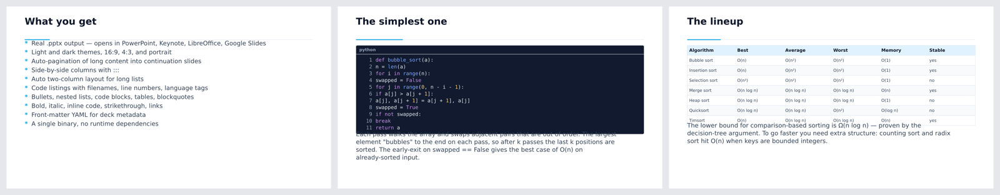
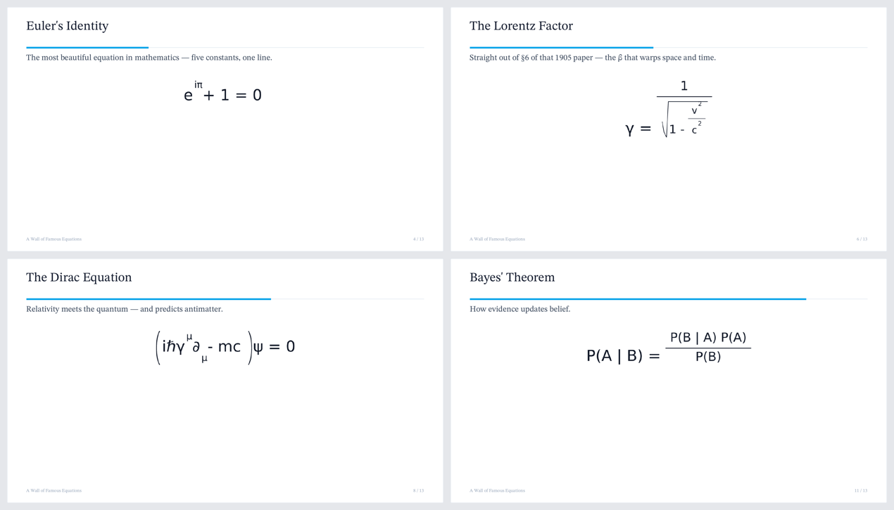
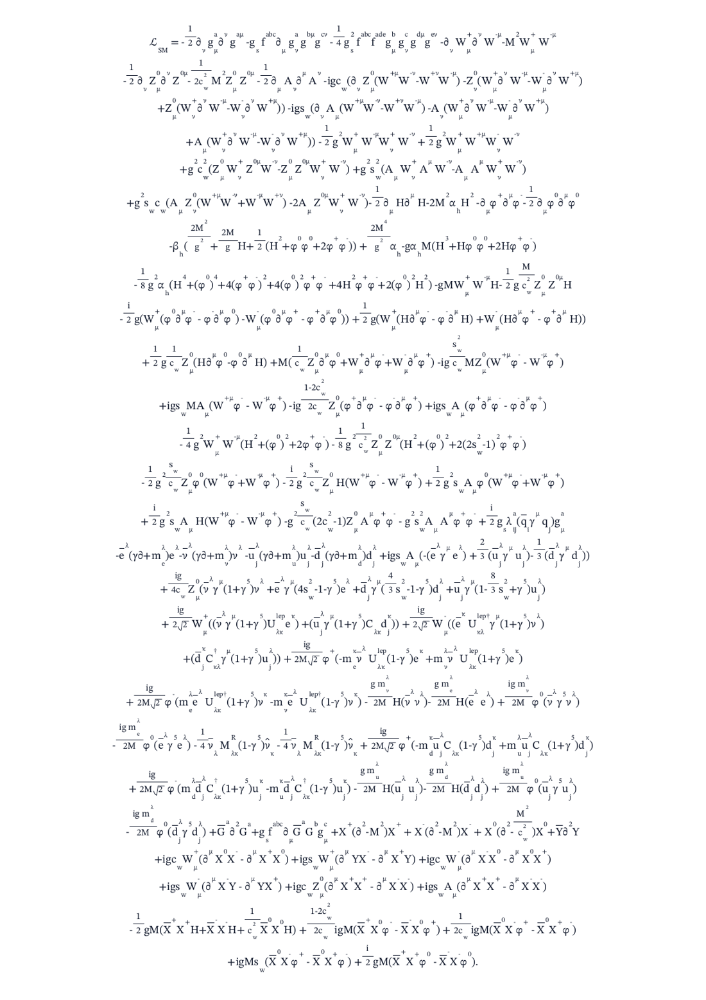
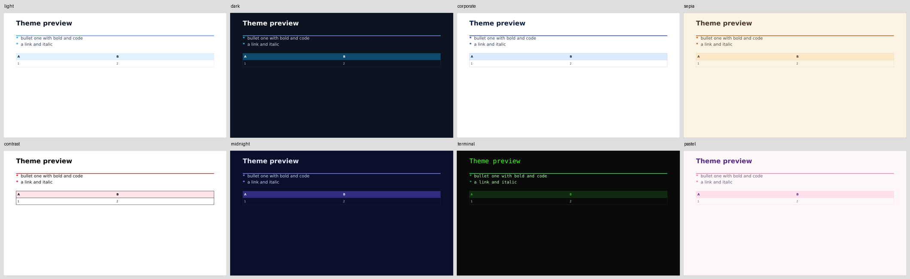

# md2any

[](https://github.com/javaperformance/md2any/actions/workflows/ci.yml)
[](https://crates.io/crates/md2any)
[](https://docs.rs/md2any)
[](#license)

**One markdown source → eight output formats.** A single self-contained Rust
binary that converts markdown into editable PowerPoint, OpenDocument Impress,
PDF, Word, LibreOffice Writer, standalone HTML, and per-slide SVG/PNG files.

<p align="center">
  
</p>

```bash
md2any talk.md                    # → talk.pptx     (PowerPoint)
md2any talk.md -o talk.odp        # → talk.odp      (LibreOffice Impress)
md2any talk.md -o talk.pdf        # → talk.pdf      (PDF 1.7)
md2any talk.md -o talk.docx       # → talk.docx     (Microsoft Word)
md2any talk.md -o talk.odt        # → talk.odt      (LibreOffice Writer)
md2any talk.md -o talk.html       # → talk.html     (browser deck)
md2any talk.md --format svg -o talk-svg/  # → slide-001.svg, slide-002.svg, ...
md2any talk.md --format png -o talk-png/  # → slide-001.png, slide-002.png, ...
```

No Office install. No headless Chromium. No LaTeX. No Node. No Python. One ~5 MB binary.

## Why md2any

| | md2any | [Pandoc] | [Marp CLI] | [Slidev] | [Quarto] |
|---|:---:|:---:|:---:|:---:|:---:|
| Editable PPTX | ✅ | ✅ | ❌ *(image-baked)* | ❌ | ✅ |
| Native ODP / ODT | ✅ | ✅ | ❌ | ❌ | ✅ |
| Native PDF (no LaTeX) | ✅ | ❌ | ❌ *(needs Chromium)* | ❌ *(needs Chromium)* | ❌ |
| DOCX | ✅ | ✅ | ❌ | ❌ | ✅ |
| Single self-contained binary | ✅ | ✅ | ⚠️ | ❌ | ❌ |
| Install size | ~5 MB | ~100 MB | ~150 MB | ~250 MB | ~500 MB+ |
| Cold start | ~5 ms | ~100 ms | ~2 s | ~3 s | ~3 s |
| Live preview server | ✅ | ❌ | ✅ | ✅ | ✅ |

[Pandoc]: https://pandoc.org/
[Marp CLI]: https://github.com/marp-team/marp-cli
[Slidev]: https://sli.dev/
[Quarto]: https://quarto.org/

md2any is the only tool in this list that produces every common Office /
OpenDocument format **natively** from a single small binary — no headless
browser, no LaTeX stack, no language runtime.

## Native math — no LaTeX, no KaTeX, no browser

A built-in layout engine renders display math (fractions, radicals, scripts,
matrices, cases, accents, bold) as **selectable text and vector geometry** —
not images, and without a TeX or JavaScript stack. Bring any math font with
`--pdf-font` (here, STIX Two Math); metrics adapt to the face automatically.

<p align="center">
  
</p>

It scales all the way up to the full **Standard Model Lagrangian** on a single
A4 page ([source](examples/standard-model-lagrangian-a4.md)):

<p align="center">
  
</p>

## Themes

Eight built-in themes (`--theme NAME`, list them with `--list-themes`), each a
palette over a light or dark base; any of them combine with any `--layout` and
`--theme-file` overrides. See [docs/theming.md](docs/theming.md) for the full
theme-file reference.

**Corporate templates / brand kits.** Already have a PowerPoint `.potx`?
`md2any theme extract corporate.potx -o brand.yaml` reads its colour and font
scheme into a reusable overlay, applied across every output format with
`--theme-file`. See [docs/branding.md](docs/branding.md).

<p align="center">
  
</p>

## Install

### Prebuilt binaries

Grab the latest release for your platform from
[GitHub Releases](https://github.com/javaperformance/md2any/releases/latest).

- **macOS (Apple Silicon)**: `md2any-vX.Y.Z-aarch64-apple-darwin.tar.gz`
- **macOS (Intel)**: `md2any-vX.Y.Z-x86_64-apple-darwin.tar.gz`
- **Linux x86_64**: `md2any-vX.Y.Z-x86_64-unknown-linux-gnu.tar.gz`
- **Linux ARM64**: `md2any-vX.Y.Z-aarch64-unknown-linux-gnu.tar.gz`
- **Windows x86_64**: `md2any-vX.Y.Z-x86_64-pc-windows-msvc.zip`

### From crates.io

```bash
cargo install md2any
```

Requires Rust 1.74+. Builds natively on Linux, macOS, and Windows.

### From source

```bash
git clone https://github.com/javaperformance/md2any
cd md2any
cargo build --release
./target/release/md2any --help
```

For cross-compilation targets, the test suite, the opt-in integration
tests, and the release workflow, see [CONTRIBUTING.md](CONTRIBUTING.md).

## Hello deck

`hello.md`:

```markdown
---
title: My Talk
author: Your Name
date: auto
theme: dark
---

# Welcome

A subtitle for the title slide.

# The pitch

- Markdown in
- Slides out
- One binary

# The features

| Feature | Status |
|---------|--------|
| Eight output formats | ✅ |
| Syntax-highlighted code | ✅ |
| Math, diagrams, footnotes | ✅ |

# Code

```rust
fn main() {
    println!("hello, md2any");
}
```

Code blocks longer than five lines get line numbers automatically. If a block
splits across continuation slides, numbering continues from the original source
line.

# Q & A
```

Then:

```bash
md2any hello.md                 # → hello.pptx
md2any hello.md -o hello.pdf    # → hello.pdf
md2any hello.md --serve         # live preview at http://localhost:8421
md2any hello.md --serve --edit  # in-browser editor + live preview (see docs/editor.md)
md2any --generate "a 5-slide intro to Rust ownership" -o intro.pptx  # AI draft → render
```

## Features

| Category | Highlights |
|----------|------------|
| **Output** | pptx · odp · pdf · docx · odt — all native, no external converters |
| **Themes** | 8 built-in (`light`, `dark`, `corporate`, `sepia`, `contrast`, `midnight`, `terminal`, `pastel`) + full custom palettes via YAML overlay |
| **Layouts** | Clean / studio / frame / bold |
| **Aspect ratios** | 16:9, 4:3, 9:16, A3/A4/A5, Letter, Legal, Tabloid + landscape variants + custom `WxH[unit]` |
| **Markdown** | Lists (9 deep nesting), task lists, tables with column alignment (`:---:` / `---:`), dark-by-default code blocks (40+ tags incl. mainframe/IBM i, Haskell/BCPL, web/API/config, and `bf`), block quotes, footnotes, links (clickable), strike, inline code, inline `<svg>` |
| **Layout extras** | Side-by-side columns (`:::`), landscape code two-up (`--code-columns` / `columns=2`), image/text full-page hints, per-slide background (`<!-- bg: -->`), TOC injection, hand-tuned pagination with widow/orphan control |
| **Math** | `$inline$` and `$$display$$` LaTeX subset -> Unicode, including accents/text/math alphabets; `--math source` preserves source; `--math svg` uses a built-in box layout for display fractions, radicals, scripts, matrices/cases/arrays, scalable delimiters, aligned equations, **bold** (`\mathbf`/`\boldsymbol`), and drawn accents (`\bar`/`\hat`/`\vec`). Font-aware metrics keep equations aligned under `--pdf-font` (incl. OTF/CFF math fonts like STIX) |
| **Diagrams** | Embedded `dot`, `mermaid`, `plantuml` (shells out if installed) |
| **Speaker notes** | `<!-- notes: -->` HTML comments |
| **Transitions** | `fade`, `push`, `wipe`, `cover`, `split` (PPTX/ODP/PDF) |
| **RTL / CJK** | `direction: rtl` right-aligns Arabic/Hebrew; PDF shapes complex scripts (Arabic/Hebrew/Indic join + reorder) via rustybuzz (per-run; full mixed-direction bidi still simplistic). CJK & emoji need `--cjk <font>` for PDF/PNG |
| **Workflow** | `--watch` for rebuild-on-save, `--serve` for live preview with hot reload, `--check` for lint mode |
| **In-browser editor** | `--serve --edit`: true live-DOM editing (each rebuild morphs into the preview, preserving scroll), caret↔slide sync both ways, a 🎨 style panel (theme/colour/size controls written to front-matter), a Generate ▾ menu to export any format, and a 🤖 AI dock that reads the deck and applies edits with one click — including a `search_images` tool so it can **find and insert real, license-cleared photos** (downloaded into `assets/` automatically). No external runtime — all served from the single binary. Full guide: [docs/editor.md](docs/editor.md) |
| **AI drafting** | `--generate "prompt"` drafts a deck via an OpenAI-compatible chat API and renders it natively. Endpoint/model/key all configurable (`--ai-endpoint`, `--ai-model`, `$MD2ANY_API_KEY` or a gitignored key file); `--save-md` keeps the markdown. Optional — drop the default `ai` feature for a network-free binary |
| **Handouts** | `--handout 2|4|6` for N-up A4 printable PDF |
| **Multi-file** | Concat multiple `.md` files; `-` reads stdin |
| **Images** | Local PNG/JPEG/SVG/**WebP** plus cached remote `http(s)` image URLs. `--localize` (or `POST /localize` in the editor) downloads remote images into `assets/` and rewrites the links for a **self-contained, offline deck**. Multi-source image search (Wikimedia Commons + Openverse keyless; Unsplash/Pexels with a key) via the AI dock or `GET /image-search?q=…` |
| **Logo** | `--logo brand.png` renders in every slide footer |

Full reference: `md2any --help-md` writes the embedded user manual to stdout, or
`md2any --help-pdf` produces it as a dark-theme PDF.

## Quickstart cheat-sheet

```text
md2any <INPUT...> [OPTIONS]
md2any new <PATH>                           Write a starter deck

  -o, --output <PATH>      Output file, or directory for svg/png
      --format <NAME>      pptx | odp | pdf | docx | odt | html | svg | png
      --doc-style <STYLE>  plain | report | handout | speaker-notes
                           DOCX/ODT profile (default report)
      --theme <NAME>       light | dark
      --aspect <RATIO>     preset (16:9, 4:3, 9:16, a4[-landscape], a3, a5,
                           letter[-landscape], legal, tabloid) or custom WxH[unit]
      --layout <NAME>      clean | studio | frame | bold
      --break-mode <MODE>  smart | simple | off
      --break-fill <PCT>   Fill target before breaking, 50-120 (default 100)
      --table-fit <MODE>   auto | split | transpose | off
      --code-theme <MODE>  dark | light | match (default: dark)
      --code-columns <MODE>
                           single | auto | two-up (default: single)
      --math <MODE>        unicode | source | svg (default: unicode)
      --math-scale <N>     Scale generated display math, 0.35-3.0
      --math-block-align <ALIGN>
                           left | center | right for generated display math
      --math-max-height <PX>
                           Max generated display math height
      --theme-file <PATH>  YAML colour/font overrides
      --logo <PATH>        Footer logo image
      --remote-image-cache <PATH>
                           Cache directory for remote image downloads
      --no-remote-image-cache
                           Fetch remote images every time
      --localize           Download remote images into assets/ and rewrite
                           links (self-contained deck)
      --cjk <FONT>         Add a CJK/emoji fallback font for PDF/PNG output
      --handout <N>        2/4/6 slides per A4 portrait page (PDF only)
      --with-notes         Presenter notes PDF, one page per slide
      --notes-page-size <SIZE>
                           slide | a4 (default: slide)
      --notes-layout <LAYOUT>
                           auto | below | side-by-side (default: auto)
      --speaker-package <DIR>
                           deck + notes PDF + handout PDF + manifest
      --pdf-font <PATH>    PDF sans/body font (TTF/OTF)
      --pdf-mono-font <PATH>
                           PDF mono/code font (TTF/OTF)
      --font-fallback <PATH[,PATH...]>
                           PDF fallback fonts for missing glyphs
      --font-audit         Report PDF glyph coverage, no output file
      --watch              Rebuild on file change
      --serve [--port N]   Live preview HTTP server
      --serve-format <FMT> pdf | html | svg | png (default pdf)
      --check              Lint mode (warnings → exit 2)
      --emit-ir <PATH>     Post-pagination IR JSON
      --emit-plan <PATH>   Estimated render-plan JSON
      --trace-layout       Print render-plan summary to stderr
      --help-{pptx,odp,pdf,docx,odt,html,svg,png,md}
                           User manual in any format
```

## Pagination rules

- First `# H1` (or front-matter `title`) → **title slide**
- Subsequent `# H1` → **section divider**
- `## H2` → **content slide**
- `---` (horizontal rule) → explicit slide break
- `:::` on its own line → side-by-side columns
- Lists with > 12 items → auto two-column layout
- Long content auto-paginates into `(cont.)` slides
- Default `--break-mode smart` splits overlong paragraphs, lists, code, tables,
  and columns at readable boundaries. Use `simple` for conservative block-level
  splitting, or `off` to disable automatic continuation splitting.
- `--break-fill PCT` controls density before a break: lower than 100 creates
  more, airier slides; higher values pack tighter.
- `--table-fit auto` reshapes wide tables before pagination: compact portrait
  tables transpose, very wide tables split into column groups, and split tables
  repeat the first column as the key column. Use `split`, `transpose`, or `off`
  to force a specific strategy.

Code fences can include source files while preserving real line numbers:

````markdown
```rust file=src/main.rs#L20-L80 title="CLI parsing"
```
````

Landscape decks can flow a long code block left/right with `--code-columns two-up`, or one fence can opt in with `columns=2`:

````markdown
```rust columns=2 title="one method"
fn parse(input: &str) {
    // line numbers continue in the right column
}
```
````

For DOCX/ODT output, pagination is replaced with flowing text. The default
`--doc-style report` adds a title page, contents, native headers/footers, themed
tables/code, captions, and section page breaks. Use `plain` for the older
minimal flow, `handout` for slide labels, or `speaker-notes` to append slide
speaker notes to the document.

## Diagnostics

Use `--emit-ir PATH` to write the post-parse/post-pagination slide tree as
JSON. Use `--emit-plan PATH` to write the estimated render plan: page geometry,
content box, pagination budget, block weights, continuation flags, and line
metadata. `--trace-layout` prints the same plan as a compact stderr summary.
`--check` also reports deck-doctor issues such as missing image alt text,
duplicated titles, dense slides, weak theme contrast, oversized tables,
incomplete speaker notes, and math constructs that the default Unicode
translator cannot render faithfully. Use `--math svg` for deterministic
built-in display math layout, including stacked fractions, radical bars,
positioned scripts, scalable `\left...\right` delimiters, multi-line blocks,
and simple matrix/cases/array/aligned environments. Use `--math-scale`,
`--math-block-align`, and `--math-max-height` to tune generated display math.

```bash
md2any talk.md --emit-ir /tmp/talk.ir.json --emit-plan /tmp/talk.plan.json
md2any talk.md --trace-layout --check
```

## Front-matter

```yaml
---
title: My Talk
subtitle: A subtitle for the title slide
author: Your Name
date: auto              # or 2026-05-23, or "today"
theme: light            # light | dark
aspect: 16:9            # see aspect ratios above
layout: clean           # clean | studio | frame | bold
math: unicode           # unicode | source | svg
math_scale: 1.0         # generated SVG display math scale
math_block_align: center # left | center | right
math_max_height: 180    # generated display math height cap
math_macros:
  '\RR': '\mathbb{R}'   # exact math substitutions before rendering
doc_style: report       # plain | report | handout | speaker-notes
break_mode: smart       # smart | simple | off
break_fill: 100         # 50-120; lower breaks earlier, higher packs tighter
table_fit: auto         # auto | split | transpose | off
code_theme: dark        # dark | light | match; code blocks default dark
code_columns: single    # single | auto | two-up
font: Inter             # any installed font (PPTX/ODP/DOCX/ODT)
logo: brand.png         # rendered in slide footer
toc: true               # inject a Contents slide after the title
transition: fade        # none | fade | push | wipe | cover | split
transition_duration: 0.6
direction: ltr          # ltr | rtl
---
```

Every key is optional. CLI flags override front-matter; front-matter overrides
defaults.

## Aspect ratios

| Flag value       | Dimensions (mm)    | Dimensions (in)   | Use for                       |
|------------------|--------------------|-------------------|-------------------------------|
| `16:9` (default) | 338.7 × 190.5 mm   | 13.33″ × 7.5″     | Modern projectors and screens |
| `4:3`            | 254 × 190.5 mm     | 10″ × 7.5″        | Legacy projectors             |
| `9:16`           | 190.5 × 338.7 mm   | 7.5″ × 13.33″     | Vertical / phone-shaped       |
| `a4` / `a4-landscape` | 210 × 297 mm  | 8.27″ × 11.69″    | A4 portrait/landscape (ISO 216) |
| `a3` / `a5`      | 297 × 420 / 148 × 210 mm | — | Larger / smaller ISO sizes |
| `letter` / `letter-landscape` | 215.9 × 279.4 mm | 8.5″ × 11″ | US Letter portrait/landscape |
| `legal`          | 215.9 × 355.6 mm   | 8.5″ × 14″        | US Legal                      |
| `tabloid`        | 279.4 × 431.8 mm   | 11″ × 17″         | Tabloid / ANSI B              |
| **custom**       | `WxH[unit]`        | px (default), mm, cm, in, pt, emu | Anything else, e.g. `1920x1080`, `300x200mm`, `13.3x7.5in` |

## Performance

| Deck size  | PPTX  | ODP   | DOCX  | ODT   | PDF    |
|------------|-------|-------|-------|-------|--------|
| 30 slides  | ~1 ms | ~1 ms | ~1 ms | ~1 ms | ~5 ms  |
| 100 slides | ~3 ms | ~2 ms | ~2 ms | ~2 ms | ~12 ms |
| 1000 slides | ~30 ms | ~25 ms | ~20 ms | ~20 ms | ~120 ms |

Numbers from a commodity x86-64 machine. PDF is slower because of PNG decode
and per-token text positioning.

## Library use

The renderer is also a regular Rust crate. See [docs.rs/md2any] for the public
API. Minimal embed:

```rust
let md = std::fs::read_to_string("talk.md")?;
let (front, body) = md2any::front_matter::extract(&md);
let theme = md2any::theme::Theme::resolve("light", "16:9", None)?;
let layout = md2any::layout::Layout::resolve("clean")?;
let slides = md2any::parser::parse(&body, &front, "talk");
let options = md2any::paginate::PaginationOptions {
    break_mode: md2any::paginate::BreakMode::Smart,
    fill: 0.9,
};
let slides = md2any::paginate::paginate_for_layout_with_options(
    slides, &theme, &layout, options,
);
let bytes = md2any::pdf::write(
    &slides, &theme, &layout, "talk", "Author",
    std::path::Path::new("."), None, None, None, 0.4, None, false,
    md2any::pdf::NotesPageSize::Slide, md2any::pdf::NotesLayout::Auto, None,
)?;
std::fs::write("talk.pdf", bytes)?;
```

[docs.rs/md2any]: https://docs.rs/md2any

## Limitations

- PNG, JPEG, and SVG images are supported; GIF and WebP are not.
- Remote `http(s)` images are supported when the default `remote-images`
  feature is enabled, with successful downloads cached between renders.
- PDF uses embedded DejaVu Sans + DejaVu Sans Mono by default, and can use
  user-supplied TTF/OTF files via `--pdf-font`, `--pdf-mono-font`, and
  `--font-fallback`
- DejaVu does not include CJK glyphs; for PDF Chinese/Japanese/Korean decks,
  pass `--cjk PATH` or include a CJK face in `--font-fallback`
- `direction: rtl` right-aligns Arabic/Hebrew but does not yet perform full
  Unicode bidirectional reordering of mixed LTR/RTL runs
- GFM table column alignment (`:---:`, `---:`) is applied in PDF / SVG / PNG /
  HTML; the editable Office/ODF outputs (pptx/odp/odt/docx) don't carry it yet
- Speaker notes attach natively in PPTX / ODP, can be emitted as a PDF
  companion with `--with-notes`, can be appended to DOCX/ODT via
  `--doc-style speaker-notes`, and can be bundled with deck + handout via
  `--speaker-package DIR`

See [HELP.md](HELP.md) for the embedded user manual, or run
`md2any --help-md` to print it.

## Contributing

Bug reports, feature suggestions, and pull requests welcome. See
[CONTRIBUTING.md](CONTRIBUTING.md) for guidelines.

## License

Dual-licensed under either of:

- MIT License ([LICENSE-MIT](LICENSE-MIT))
- Apache License, Version 2.0 ([LICENSE-APACHE](LICENSE-APACHE))

at your option.

Bundled DejaVu font files are redistributed under their own permissive font
license; see [assets/fonts/LICENSE.md](assets/fonts/LICENSE.md). Release
archives that include the standalone binary should include that notice because
the font programs are embedded in the executable.

Unless you explicitly state otherwise, any contribution intentionally submitted
for inclusion in md2any by you, as defined in the Apache-2.0 license, shall be
dual licensed as above, without any additional terms or conditions.
