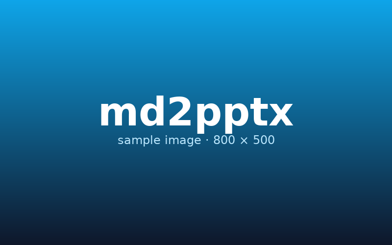
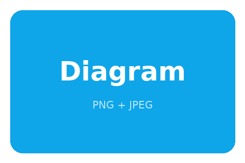

# Why this exists

Slide tools are heavy, hand-coded HTML decks rot, and PowerPoint refuses to die.

A single Rust binary that turns plain Markdown into a clean `.pptx` file is the right shape for the job. Edit in your favorite editor. Render in a heartbeat. Ship.

## What you get

- Real `.pptx` output — opens in PowerPoint, Keynote, LibreOffice, Google Slides
- Light and dark themes, 16:9, 4:3, and portrait
- Auto-pagination of long content into continuation slides
- Side-by-side columns with `:::`
- Auto two-column layout for long lists
- Code listings with filenames, line numbers, language tags
- Bullets, nested lists, code blocks, tables, blockquotes
- Bold, *italic*, `inline code`, ~~strikethrough~~, [links](https://example.com)
- Front-matter YAML for deck metadata
- A single binary, no runtime dependencies

# Layout features

## Side-by-side columns

Put `:::` on a line by itself to split a slide horizontally.

### Markdown

```
## Slide title

Left column content here.

:::

Right column content here.
```

### Rendered

Everything before the marker is the left column. Everything after is the right.

## Side-by-side in practice

**Why this matters**

Two things you want to compare belong next to each other, not on consecutive slides. Side-by-side preserves the comparison; consecutive slides force the audience to remember the first half.

Use it for: before/after, cause/effect, do/don't, problem/solution, code/explanation.

:::

**How to use it**

```
Left side
:::
Right side
```

Both columns paginate within themselves. You don't have to balance the heights manually — md2any scales each column to fit the available area independently.

## Long lists auto-flow

Lists with more than 12 items wrap into two columns automatically. No marker needed.

- First item in the long list
- Second item with some text
- Third item demonstrating wrap
- Fourth item keeps going
- Fifth item adds variety
- Sixth item with **bold** text
- Seventh has `inline code`
- Eighth item is short
- Ninth item continues
- Tenth item is here
- Eleventh item — getting long
- Twelfth — last in the first column
- Thirteenth starts the second column
- Fourteenth item
- Fifteenth item
- Sixteenth item

# Code listings

## Inline language tag

A code fence with just a language gets a small language label.

```rust
fn main() {
    println!("Hello, slides!");
}
```

## With a filename caption

Put a filename after the language: ` ```rust src/main.rs `. The filename appears in a header bar above the code, with the language tag to its right.

```rust src/main.rs
use anyhow::Result;
use clap::Parser;

#[derive(Parser)]
struct Cli {
    input: String,
}

fn main() -> Result<()> {
    let cli = Cli::parse();
    println!("converting {}", cli.input);
    Ok(())
}
```

## With line numbers

Code blocks longer than five lines get line numbers automatically.

```python pipeline.py
def transform(rows):
    for row in rows:
        row["price"] = row["price"] * 1.1
        row["currency"] = "EUR"
        yield row

def write_jsonl(rows, path):
    with open(path, "w") as f:
        for row in rows:
            f.write(json.dumps(row) + "\n")
```

# Layouts

## Four ways to dress the same deck

md2any ships with four built-in layouts. Pick one with `--layout` or set `layout:` in front matter. Each one is a coordinated treatment — background, title style, section dividers, and title slide all change together.

- `clean` — minimal title underline, full-bleed content (default)
- `studio` — vertical accent rail, italic titles, big background numerals on sections
- `frame` — left sidebar holds deck title and slide number; content lives on the right
- `bold` — full-width accent block behind every title

Same markdown, four very different decks. Light and dark themes apply to all four.

```bash
md2any talk.md --layout studio
md2any talk.md --layout frame --theme dark
md2any talk.md --layout bold
```

## When to use which

**clean** — talks, internal updates, anything where you want the content to be the loudest thing on the slide.

**studio** — editorial-feel decks, design reviews, fund-raising memos. The rail and numerals look serious without being heavy.

:::

**frame** — long-form decks where the audience benefits from a persistent reference panel (chapter name, page number). Good for training and onboarding decks.

**bold** — keynote-style talks where every section transition should feel like an event. Lots of accent color on every slide.

# Mainframe languages

## COBOL

Case-insensitive, hyphens in identifiers, column-7 comment indicator.

```cobol HELLO.cbl
       IDENTIFICATION DIVISION.
       PROGRAM-ID. HELLO.
      *
       DATA DIVISION.
       WORKING-STORAGE SECTION.
       01  WS-NAME       PIC X(20) VALUE 'mainframe'.
       01  WS-COUNT      PIC 9(3)  COMP-3 VALUE 5.
      *
       PROCEDURE DIVISION.
           DISPLAY 'Hello, ' WS-NAME '!'.
           PERFORM VARYING I FROM 1 BY 1 UNTIL I > WS-COUNT
               DISPLAY 'iteration ' I
           END-PERFORM.
           STOP RUN.
```

## JCL

`//*` for comments, `//` starts every statement, parameters are `KEY=VALUE`.

```jcl HELLO.jcl
//HELLO    JOB  (ACCT),'PAUL',CLASS=A,MSGCLASS=X,NOTIFY=&SYSUID
//*
//*  RUN A SIMPLE BATCH STEP
//*
//STEP1    EXEC PGM=IEFBR14
//SYSPRINT DD   SYSOUT=*
//SYSIN    DD   *
  HELLO MAINFRAME
/*
//STEP2    EXEC PGM=SORT,COND=(0,LT,STEP1)
//SORTIN   DD   DSN=PAUL.INPUT,DISP=SHR
//SORTOUT  DD   DSN=PAUL.OUTPUT,DISP=(NEW,CATLG)
```

## REXX

`/* */` block comments, case-insensitive keywords, classic scripting feel.

```rexx hello.rex
/* hello.rex — sample REXX script */
parse arg name
if name = '' then name = 'mainframe'
say 'Hello,' name'!'
do i = 1 to 5
  say 'iteration' i
end
exit 0
```

## PL/I

`/* */` comments, single-quoted strings, declarations with attributes.

```pli hello.pli
 HELLO: PROC OPTIONS(MAIN);
    DCL NAME      CHAR(20) VARYING INIT('mainframe');
    DCL COUNT     FIXED BIN(31) INIT(5);
    DCL I         FIXED BIN(31);

    PUT SKIP LIST('Hello, ' || NAME || '!');
    DO I = 1 TO COUNT;
       PUT SKIP LIST('iteration ', I);
    END;
 END HELLO;
```

## HLASM

Column-1 `*` for comments, mnemonics highlighted, `&VAR` macro variables.

```hlasm HELLO.asm
*  HELLO WORLD ASSEMBLER PROGRAM
HELLO    CSECT
         USING HELLO,R15
         STM   R14,R12,12(R13)      SAVE REGISTERS
         LA    R3,5                 ITERATION COUNT
LOOP     EQU   *
         WTO   'Hello, mainframe!'  WRITE TO OPERATOR
         BCT   R3,LOOP              DECREMENT AND BRANCH
         LM    R14,R12,12(R13)      RESTORE REGISTERS
         BR    R14                  RETURN
         LTORG
         END   HELLO
```

## DB2 DDL

Recognises the standard SQL keywords plus DB2 catalog and tablespace specifics.

```db2 CUSTOMER.ddl
-- CREATE A TABLESPACE AND A TABLE INSIDE IT
CREATE TABLESPACE TS001
    IN DATABASE DBPROD
    USING STOGROUP SG1
    PRIQTY 720 SECQTY 720
    BUFFERPOOL BP0
    LOCKSIZE PAGE
    COMPRESS YES;

CREATE TABLE PAUL.CUSTOMER (
    CUST_ID    INTEGER       NOT NULL GENERATED ALWAYS AS IDENTITY,
    CUST_NAME  VARCHAR(50)   NOT NULL,
    CUST_TIER  CHAR(1)       DEFAULT 'B' CHECK (CUST_TIER IN ('A','B','C')),
    CREATED_AT TIMESTAMP     NOT NULL DEFAULT CURRENT_TIMESTAMP,
    PRIMARY KEY (CUST_ID)
)   IN DBPROD.TS001
    CCSID UNICODE;

CREATE INDEX PAUL.CUST_NAME_IX
    ON PAUL.CUSTOMER (CUST_NAME ASC)
    BUFFERPOOL BP1;
```

# Themes

## Light vs dark

**Light theme**

Default. White background, slate text, sky-blue accent. Reads well in a bright room, prints clean, looks like a polished tech-company deck.

Use `--theme light` or omit (it's the default).

:::

**Dark theme**

Slate-900 background, frost-bright accent. Reads well on stage, easier on the eyes during a long talk, photographs cleanly from the back of the room.

Use `--theme dark`.

# Aspect ratios

## Choose with `--aspect`

```bash
md2any talk.md --aspect 16:9       # default, widescreen
md2any talk.md --aspect 4:3        # legacy projectors
md2any talk.md --aspect 9:16       # portrait, phone-shaped
md2any talk.md --aspect a4         # paper-shaped portrait
md2any talk.md --aspect letter     # US letter portrait
```

The portrait layouts adjust typography automatically — smaller titles, narrower content area, single-column lists.

# Images

## Embedded images

Use standard markdown image syntax. PNG and JPEG are supported. Paths resolve relative to the markdown file.



<!-- notes: This is the hero image. Mention how it was generated with Python + Pillow during the demo. Audience usually asks about cross-platform compatibility — emphasize that Pillow isn't required at md2any runtime; the image is just a regular file on disk. -->

## Side-by-side image + text

Images compose with everything else, including columns. Put an image on one side, your commentary on the other.



:::

**Two supported formats**

PNG and JPEG. No GIF, no SVG, no WebP for now.

**Sizing**

Images fit to the available content area, preserving aspect ratio. Auto-centered horizontally.

**Captions**

Whatever you write in the markdown alt text becomes a small caption below the image.

<!-- speaker notes: Demo tip - if you want to suppress the caption, use empty alt text like . Otherwise the alt text always shows. -->

# Speaker notes

## How to add notes

Put an HTML comment that starts with `notes:` or `speaker notes:` anywhere on the slide. They attach to the slide they're written on.

```markdown
## A slide title

Visible content here.

<!-- notes: Reminder to ad-lib about the migration timeline. Reference the Q3 deck. -->
```

The notes appear in PowerPoint's presenter view and printed as note pages.

<!-- notes: Every slide in this demo deck has speaker notes attached. Open the deck in PowerPoint and switch to Presenter View to see them. -->

## Multiple notes

Multiple `<!-- notes: -->` comments on the same slide are concatenated with blank lines between them. Useful when notes accrete during drafting.

<!-- notes: First note - mention the dev cycle. -->

<!-- notes: Second note - acknowledge that PowerPoint and Keynote both render these correctly, but Google Slides drops them on import. -->

<!-- notes: Third note - rehearse this slide twice before going live. -->

# Tables

## Feature matrix

| Feature             | Status   | Notes                                |
|---------------------|----------|--------------------------------------|
| Headings            | Done     | H1 title, H2 content, H3+ inline     |
| Lists               | Done     | Nested, auto-2-column when long      |
| Code blocks         | Done     | Filename, language, line numbers     |
| Tables              | Done     | Banded rows, accent header           |
| Side-by-side        | Done     | `:::` marker                         |
| Portrait            | Done     | 9:16, A4, Letter                     |
| Dark mode           | Done     | Polished palette                     |
| Images              | TODO     | v0.2                                 |
| Speaker notes       | TODO     | v0.2                                 |

# Quotes

> The best presentation tool is the one that gets out of your way.
>
> Plain text in, polished slides out. That's the whole product.

---

This is a continuation slide created with an explicit `---` rule. The title carries over.

# Performance

Single-pass Markdown parse via `pulldown-cmark`. OOXML emitted directly to a `zip::ZipWriter`. No intermediate AST beyond the slide IR. Cold-start binary in tens of milliseconds.

A thousand-slide deck renders in about 30 ms on commodity hardware.

# That's it

Write Markdown. Run one command. Open the `.pptx`. Present.
