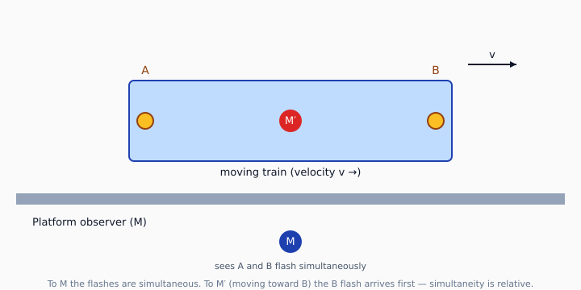
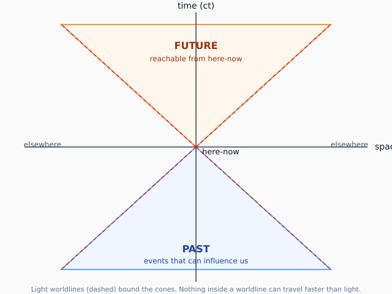
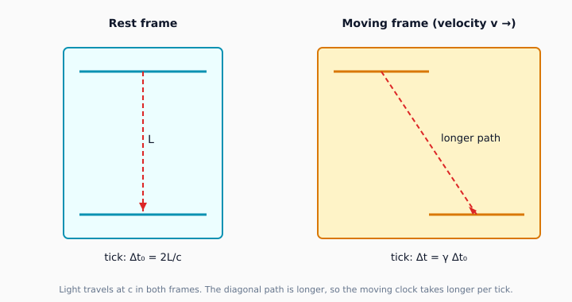

# Why a new theory was needed

## The crisis of 1900

Two pillars of nineteenth-century physics were quietly disagreeing.

- **Newtonian mechanics** said the laws of physics look the same in any frame moving at constant velocity. Galilean.
- **Maxwell's equations** said light is an electromagnetic wave with a fixed speed $c$. But fixed in *which* frame?

The obvious answer was the **luminiferous aether** — a stationary medium that filled space and gave electromagnetism its preferred frame. It was an elegant fix, except for one inconvenient detail.

<!-- notes: Open by pointing out that nineteenth-century physics looked finished. Lord Kelvin's "two small clouds" speech is the famous teaser — those clouds turned out to be quantum mechanics and special relativity. -->

## The Michelson-Morley experiment (1887)

Albert Michelson and Edward Morley built an interferometer sensitive enough to detect the Earth's motion through the aether — a "wind" of about 30 km/s as the Earth orbits the Sun.

They measured **nothing**. No drift, no fringe shift, no aether wind. Repeated with ever-better precision into the 1900s and the answer kept coming back: zero.

> The result of the hypothesis of a stationary aether is shown to be incorrect.
> — *Michelson & Morley, American Journal of Science, 1887*

Either the aether was perfectly dragged along with the Earth (no other evidence for that), or it didn't exist.

## Lorentz's fix and Einstein's leap

Hendrik Lorentz patched Maxwell's theory by proposing that moving objects physically contracted along the direction of motion, just enough to hide the aether drift from any experiment. It worked mathematically but felt like a fudge.

In 1905, a 26-year-old patent clerk in Bern published *Zur Elektrodynamik bewegter Körper* — "On the Electrodynamics of Moving Bodies". His move: **drop the aether entirely**, accept the experimental result as fundamental, and rebuild mechanics from two postulates.

# The two postulates

## Special Relativity in two sentences

1. **The laws of physics are the same in every inertial (non-accelerating) frame.**
2. **The speed of light in vacuum is the same — $c$ ≈ 299,792,458 m/s — in every inertial frame, independent of the motion of the source or the observer.**

Everything that follows is a consequence of these two statements taken seriously.

```markdown
$c \approx 2.998 \times 10^{8}\ \text{m/s}$
```

Renders as: $c \approx 2.998 \times 10^{8}$ m/s.

# Simultaneity is relative

## Einstein's train



Two lightning bolts strike the ends of a moving train. A platform observer M, equidistant from both strikes, sees them as **simultaneous**. The train observer M′ is moving toward strike B, so the light from B reaches M′ first — she records B *before* A.

Both observers are correct. There is no privileged frame, so there is no privileged answer to "did these two events happen at the same time?" Simultaneity is not a property of events; it's a property of an observer's frame.

# The light cone

## Past, future, and elsewhere



Every event in spacetime has three regions around it:

- **Future cone:** events that can be reached from here-now without exceeding $c$.
- **Past cone:** events that could have influenced here-now.
- **Elsewhere:** events outside the cones. No causal connection in either direction — different observers can even disagree about their time-ordering.

The cone's surface is traced by light rays. Massive objects move strictly inside the cone.

# Time dilation

## Moving clocks run slow



A "light clock" bounces a photon between two mirrors. In its own rest frame the round-trip is straight up-and-down: $\Delta t_0 = 2L/c$.

Viewed from a frame in which the clock moves at velocity $v$, the photon traces a longer diagonal path. Since $c$ is the same in both frames, the moving clock takes *longer* per tick:

$$\Delta t = \gamma \Delta t_0, \quad \gamma = \frac{1}{\sqrt{1 - v^2/c^2}}$$

$\gamma$ is the **Lorentz factor**. At everyday speeds it's almost exactly 1; near $c$ it blows up.

## How big is the effect?

| Speed $v$         | Fraction of $c$ | $\gamma$       | Effect           |
|-------------------|-----------------|----------------|------------------|
| jogging (3 m/s)   | $10^{-8}$       | 1.00000000005  | undetectable     |
| Concorde (600 m/s)| $2\times10^{-6}$| 1.0000000000002| undetectable     |
| ISS (7.7 km/s)    | $2.6\times10^{-5}$ | 1.0000000003 | 0.007 s/year     |
| 0.5 $c$           | 0.5             | 1.155          | clock runs 13% slower |
| 0.9 $c$           | 0.9             | 2.294          | clock runs 56% slower |
| 0.99 $c$          | 0.99            | 7.089          | 7× slower        |
| 0.999 $c$         | 0.999           | 22.366         | 22× slower       |

# Length contraction

## Lorentz contraction

A rod of rest length $L_0$, moving along its length at velocity $v$ relative to you, has measured length

$$L = \frac{L_0}{\gamma}$$

Same Lorentz factor, applied to space instead of time. A 1-metre stick moving at 0.9 $c$ measures 44 cm to a stationary observer.

This is not a measurement artefact. The rod is *actually* shorter in your frame. In the rod's own frame it remains 1 metre — and in *its* frame, *you* are contracted along your direction of motion.

# The Lorentz transformation

## Replacing the Galilean transformation

Newton said an event at $(t, x)$ in one frame appears at $(t', x')$ in a frame moving at velocity $v$, where:

$$t' = t, \quad x' = x - vt$$

Einstein replaced this with the **Lorentz transformation**:

$$t' = \gamma\left(t - \frac{vx}{c^2}\right), \quad x' = \gamma(x - vt)$$

In the limit $v \ll c$ this reduces to Galileo's rules — Newtonian mechanics is the low-speed approximation. SR doesn't overthrow Newton; it contains him as a special case.

## Side by side

| Quantity         | Galilean         | Lorentz                                |
|------------------|------------------|----------------------------------------|
| Time             | $t' = t$         | $t' = \gamma(t - vx/c^2)$              |
| Position         | $x' = x - vt$    | $x' = \gamma(x - vt)$                  |
| Velocity addition| $u' = u - v$     | $u' = (u - v)/(1 - uv/c^2)$            |
| Simultaneity     | absolute         | frame-dependent                        |
| Mass             | invariant        | rest mass invariant, relativistic mass increases |

# Velocity addition

## You can't beat the universal speed limit

If a rocket moving at $u$ fires a missile forward at $v$ (both relative to the rocket), the missile's velocity relative to a stationary observer is **not** $u + v$. It's:

$$u_{\text{total}} = \frac{u + v}{1 + uv/c^2}$$

Try $u = 0.9c$ and $v = 0.9c$. Classical mechanics says $1.8c$. Special relativity says:

$$u_{\text{total}} = \frac{1.8c}{1 + 0.81} = \frac{1.8c}{1.81} \approx 0.994\,c$$

Close to $c$, but never reaching it. Sub-luminal plus sub-luminal stays sub-luminal — always.

# Energy and momentum

## The famous one

For a particle of rest mass $m$ at velocity $v$, energy and momentum are:

$$E = \gamma m c^2, \quad p = \gamma m v$$

When $v = 0$, this collapses to the most famous equation in physics:

$$E_0 = m c^2$$

The rest energy of a one-gram pebble is $9 \times 10^{13}$ joules — about 25 million kilowatt-hours, or the energy released by 21 kilotons of TNT. Nuclear weapons are not "matter turning into energy" any more than a falling rock is gravitational potential turning into kinetic; they convert a small fraction of nuclear binding energy. But the rest-energy bookkeeping is exact.

## The full relation

When the particle is moving:

$$E^2 = (pc)^2 + (mc^2)^2$$

For massless particles ($m = 0$, like photons), $E = pc$. For slow massive particles, expanding to first order in $v/c$ recovers $E = mc^2 + \frac{1}{2}mv^2$ — rest energy plus the classical kinetic term.

# Experimental tests

## Special relativity is the most-tested theory in physics

| Year | Experiment                       | What it confirmed                          |
|------|----------------------------------|--------------------------------------------|
| 1887 | Michelson-Morley                 | No aether wind to detect                   |
| 1908 | Bucherer                         | Mass-velocity relation for electrons       |
| 1932 | Kennedy-Thorndike                | Independence from Earth's motion           |
| 1938 | Ives-Stilwell                    | Relativistic Doppler shift in hydrogen     |
| 1940 | Rossi-Hall (cosmic-ray muons)    | Time dilation extends muon lifetime ×30    |
| 1971 | Hafele-Keating (atomic clocks)   | Direct time dilation, atomic clocks on jets|
| 1977 | CERN muon storage ring           | $\gamma = 29$, lifetime extended exactly   |
| 2001 | Brillet-Hall (cavity resonators) | Isotropy of $c$ to $10^{-15}$              |
| 2009 | LHC                              | Routine relativistic kinematics            |

Every experiment that *could* falsify SR has failed to do so. The bound on any deviation from constant $c$ is now better than one part in $10^{17}$.

# The Twin Paradox

## A puzzle with a real resolution

Alice stays on Earth. Bob boards a rocket, flies to a star 4 light-years away at 0.8 $c$, and returns. They reunite.

From Alice's frame, Bob's clock ran slow ($\gamma = 1.67$). She ages 10 years; Bob ages 6.

From *Bob's* frame, Alice was the one moving. Shouldn't *she* be the younger one?

**No** — and the asymmetry is not symmetric. Alice stays in one inertial frame the whole time. Bob does not: he accelerates at takeoff, turnaround, and landing. Those acceleration phases break the symmetry. Special relativity handles the inertial legs; general relativity (or careful SR with non-inertial frames) handles the turnaround. The answer is unambiguous: **Bob is younger**.

This was tested directly in 1971 by Hafele and Keating, who flew caesium clocks around the world on commercial jets. The result agreed with the SR prediction to within experimental error.

# Real-world consequence: GPS

## You use special relativity every day

Your phone's GPS receives time-stamped signals from satellites in 20,200 km orbits. The position fix depends on sub-microsecond timing differences between signals.

GPS satellites move at about 3.9 km/s relative to ground users. Special relativity says their on-board clocks run **slow** by about **7 microseconds per day** relative to ground clocks.

General relativity adds the opposite effect: the satellites are in weaker gravity, so their clocks run **fast** by **45 microseconds per day**.

Net: satellite clocks tick about 38 µs/day faster than ground clocks. The satellites pre-adjust their rates by exactly that amount before launch. Without the correction, position fixes would drift by ~10 km per day.

> If the corrections were not made, GPS would fail in its navigational functions within about 2 minutes.
> — *Neil Ashby, "Relativity in the Global Positioning System", Living Reviews in Relativity, 2003*

# What came next

## General Relativity (1915)

Special Relativity handles inertial frames. Einstein spent the next decade extending it to non-inertial frames — frames undergoing acceleration. The result was **General Relativity**, in which gravity is no longer a force but the curvature of spacetime induced by mass and energy.

GR predictions, all confirmed:

- Mercury's perihelion precession (calculated 1915, fits to arcsecond)
- Bending of starlight by the Sun (Eddington, 1919)
- Gravitational redshift (Pound-Rebka, 1959)
- Gravitational lensing (Walsh et al., 1979, ongoing)
- Frame dragging (Gravity Probe B, 2011)
- Gravitational waves (LIGO, 2015)
- Black hole imaging (Event Horizon Telescope, 2019)

Special relativity remains exactly true in any region small enough to ignore spacetime curvature — which is most regions you'll ever inhabit.

# What md2any showed off in this deck

## Feature index

- **Math:** $\sum$, $\gamma$, $\sqrt{}$, $\frac{}{}$, $\times 10^n$, sub/superscripts, display equations
- **Tables:** simple two-column, four-column with units, comparison side-by-side
- **SVG diagrams:** the light cone, the train experiment, the light-clock
- **Block quotes** with attribution
- **Speaker notes:** see the slide-1 source for an example
- **Ordered + bulleted lists**, nested
- **Inline formatting**: **bold**, *italic*, `inline code`
- **Front-matter TOC**: a Contents slide generated automatically after the title
- **External links** to references like [Living Reviews in Relativity](https://link.springer.com/article/10.12942/lrr-2003-1)

Sources for facts: Einstein's 1905 paper *Zur Elektrodynamik bewegter Körper*; Wolfgang Rindler, *Relativity: Special, General and Cosmological* (Oxford, 2006); Neil Ashby's *Living Reviews* article on GPS.
