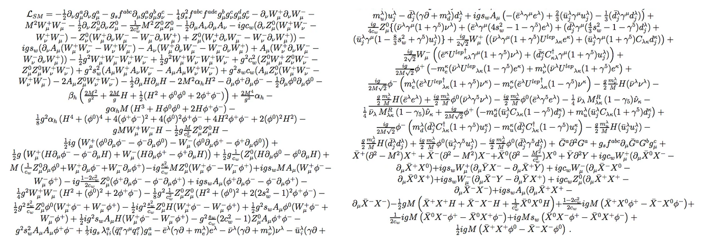

# Standard Model Stress

## Reference Image

{width=100%}

## Gauge, Higgs, And Potential

$$
\begin{aligned}
\mathcal{L}_{gauge} =& -\frac{1}{4}G_{\mu\nu}^{a}G^{a\mu\nu}
-\frac{1}{4}W_{\mu\nu}^{i}W^{i\mu\nu}
-\frac{1}{4}B_{\mu\nu}B^{\mu\nu} \\
&+ (D_{\mu}\Phi)^{\ast}(D^{\mu}\Phi)
+\mu^{2}\Phi^{\ast}\Phi
-\lambda(\Phi^{\ast}\Phi)^{2}
\end{aligned}
$$

$$
V(\Phi)=
\left[
\begin{array}{cc}
-\mu^{2}\Phi^{\ast}\Phi & \lambda(\Phi^{\ast}\Phi)^{2} \\
M_{W}^{2}W_{\mu}^{+}W^{-\mu} & \frac{1}{2}M_{Z}^{2}Z_{\mu}Z^{\mu}
\end{array}
\right]
$$

## Fermion Kinetic Terms

$$
\begin{aligned}
\mathcal{L}_{fermion} =&
i\bar{q}_{L}\gamma^{\mu}D_{\mu}q_{L}
+i\bar{u}_{R}\gamma^{\mu}D_{\mu}u_{R}
+i\bar{d}_{R}\gamma^{\mu}D_{\mu}d_{R} \\
&+i\bar{\ell}_{L}\gamma^{\mu}D_{\mu}\ell_{L}
+i\bar{e}_{R}\gamma^{\mu}D_{\mu}e_{R}
+i\bar{\nu}_{L}\gamma^{\mu}D_{\mu}\nu_{L}
\end{aligned}
$$

$$
\begin{aligned}
\mathcal{L}_{Yukawa} =&
-y_{u}\bar{q}_{L}\tilde{\Phi}u_{R}
-y_{d}\bar{q}_{L}\Phi d_{R}
-y_{e}\bar{\ell}_{L}\Phi e_{R} \\
&-y_{\nu}\bar{\ell}_{L}\tilde{\Phi}\nu_{R}
+h.c.
\end{aligned}
$$

## Interaction Pressure

$$
\begin{aligned}
\mathcal{L}_{int} =&
g_{s}f^{abc}(\partial_{\mu}G_{\nu}^{a})G^{b\mu}G^{c\nu}
+g\epsilon^{ijk}(\partial_{\mu}W_{\nu}^{i})W^{j\mu}W^{k\nu} \\
&+\frac{g}{\sqrt{2}}\left(W_{\mu}^{+}J_{W}^{\mu}+W_{\mu}^{-}\bar{J}_{W}^{\mu}\right)
+\frac{g}{c_{w}}Z_{\mu}J_{Z}^{\mu}
+eA_{\mu}J_{em}^{\mu} \\
&+g^{2}W_{\mu}^{+}W^{-\mu}H^{2}
+\frac{g^{2}}{4c_{w}^{2}}Z_{\mu}Z^{\mu}H^{2}
+\lambda vH^{3}
+\frac{\lambda}{4}H^{4}
\end{aligned}
$$

## Mass And Mixing Summary

$$
\begin{cases}
M_{W}=\frac{1}{2}gv & charged\ vector \\
M_{Z}=\frac{1}{2}\sqrt{g^{2}+g'^{2}}v & neutral\ vector \\
m_{f}=\frac{y_{f}v}{\sqrt{2}} & fermion
\end{cases}
$$

$$
\left[
\begin{array}{ccc}
G_{\mu}^{1} & G_{\mu}^{2} & G_{\mu}^{3} \\
W_{\mu}^{+} & Z_{\mu}^{0} & A_{\mu} \\
\phi^{+} & H & \phi^{0}
\end{array}
\right]
\quad
\binom{\nu_{e}}{e^{-}}
\quad
\left\lVert D_{\mu}\Phi \right\rVert^{2}
$$
