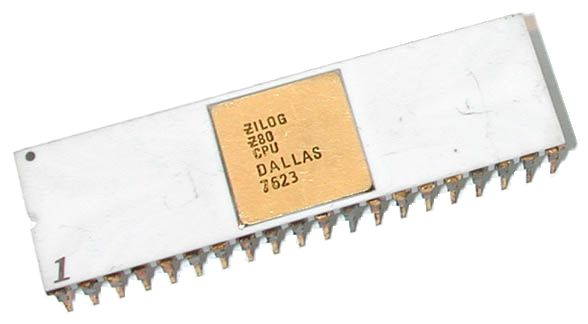
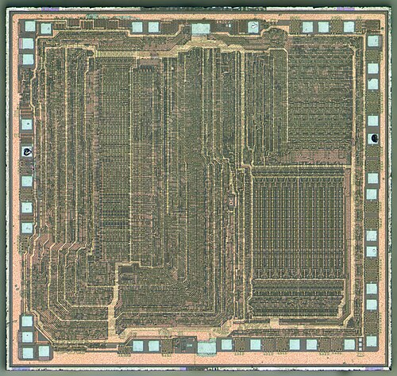
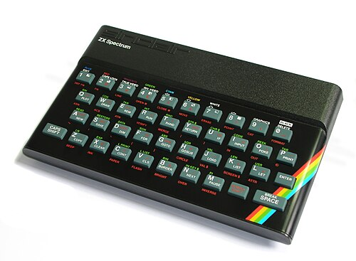

# The Z80 Story

## The Rebel Engineer
Federico Faggin arrived at Intel in 1970 already a veteran of Fairchild's breakthroughs. He poured himself into the 4004 and then the 8080, only to watch management grow cautious and short-sighted. By 1974 the frustration had become unbearable; Faggin walked out, determined to build something better on his own terms.

## Founding Zilog
<!-- layout: image-right -->


With Ralph Ungermann he launched Zilog that same year. The mission was simple and audacious: surpass Intel at its own game. They lured away the brightest engineers and set to work on a microprocessor that would keep every 8080 program running while offering far more power and elegance.

# The Launch

## The Gamble
In July 1976 the Z80 hit the market at a price that undercut the 8080 yet delivered capabilities Intel had never imagined. Hobbyists embraced it instantly; manufacturers lined up to second-source it. The gamble had paid off—the chip that shouldn't have existed was suddenly everywhere.

## Silicon Heart
<!-- layout: image-left -->


Inside the familiar 40-pin package lived an architecture that felt almost alive. Full binary compatibility meant existing 8080 software ran without change, while new instructions and registers opened doors the older chip had kept firmly shut.

## The Die Revealed
<!-- layout: image-full -->


## What Made It Special
The Z80 carried alternate register banks that let programmers swap contexts in a single instruction. Fresh IX and IY index registers turned awkward memory access into clean, readable code. Best of all, it needed only a single +5 V rail—no more juggling three separate voltages just to keep the machine alive.

## Z80 vs Intel 8080
| Feature          | Z80                  | Intel 8080          |
|------------------|----------------------|---------------------|
| Registers        | 22 total (alt + IX/IY) | 8 main + few        |
| Clock speed      | up to 20 MHz         | up to 10 MHz        |
| Power supply     | single +5 V          | +5 / -5 / +12 V     |
| Instructions     | 158 (incl. block)    | 78                  |

## Built-in DRAM Refresh
Hidden inside the silicon was circuitry that refreshed dynamic RAM without any extra chips or timing headaches. Systems became smaller, cheaper, and more reliable overnight—an advantage that mattered most to the cost-conscious engineers building the first wave of personal computers.

# Software Ecosystem

## CP/M and the Software Boom
Gary Kildall's CP/M found its perfect partner in the Z80. The extra registers let the operating system run faster and smoother than on the 8080, and a flood of business tools, languages, and utilities followed. For the first time, ordinary people could buy software instead of writing every line themselves.

## Z80 Assembly Example
```asm
delay: LD   B, 0FFh   ; outer loop count
inner: LD   A, (HL)   ; load byte
       INC  HL
       DJNZ inner     ; dec B, loop if !=0
       RET
```

## The Software Explosion
Assemblers, BASIC interpreters, early spreadsheets, and bedroom-coded games poured forth. The Z80 turned every machine it powered into a platform, laying the foundation for the personal-computing software industry we still inhabit today.

# Home Computers

## The Machines That Defined an Era
<!-- layout: image-left -->


From the moment the TRS-80 Model I appeared in 1977, the Z80 became the heartbeat of home computing. Sinclair's ZX Spectrum brought vivid color and bedroom coding to millions; the Amstrad CPC and Japanese MSX standard carried the same spirit across continents.

## Iconic Z80 Machines
| Machine            | Launch |
|--------------------|--------|
| TRS-80 Model I     | 1977   |
| ZX Spectrum        | 1982   |
| MSX                | 1983   |
| Amstrad CPC        | 1984   |
| Sega Master System | 1985   |
| Nintendo Game Boy  | 1989   |

# Gaming Consoles

## Sega Master System
Released in 1985, the Master System ran its Z80 at 3.58 MHz alongside a superb sound chip. Titles like Phantasy Star proved the little processor could still deliver rich worlds long after its desktop rivals had moved on.

## Game Boy's Sharp LR35902
Nintendo's 1989 handheld used a custom Z80 variant stripped for efficiency yet still unmistakably Z80 at heart. Paired with clever graphics hardware, it launched the portable-gaming revolution and sold more than 118 million units.

# Industrial Longevity

## The Chip That Wouldn't Die
While flashier processors came and went, the Z80 remained in production for over forty-five years. Its rock-solid reliability made it the default choice for traffic lights, medical instruments, printers, and factory controllers—quietly running the modern world long after its glory days in home computers.

## Modern Legacy
Open-source cores such as T80 keep the Z80 alive inside FPGAs. Retro enthusiasts and chiptune artists still celebrate its elegant instruction set. More than a processor, it became a symbol of practical, enduring engineering—the rebel chip that refused to fade away.

## Image Credits

Photographs via Wikimedia Commons, reused under their Creative Commons licenses:

- Z80 die shot — ZeptoBars (CC BY 3.0)
- Z80 chip package — Gennadiy Shvets (CC BY 2.5)
- Federico Faggin — Intel Free Press (CC BY-SA 2.0)
- ZX Spectrum — Bill Bertram / Pixel8 (CC BY-SA 2.5)
